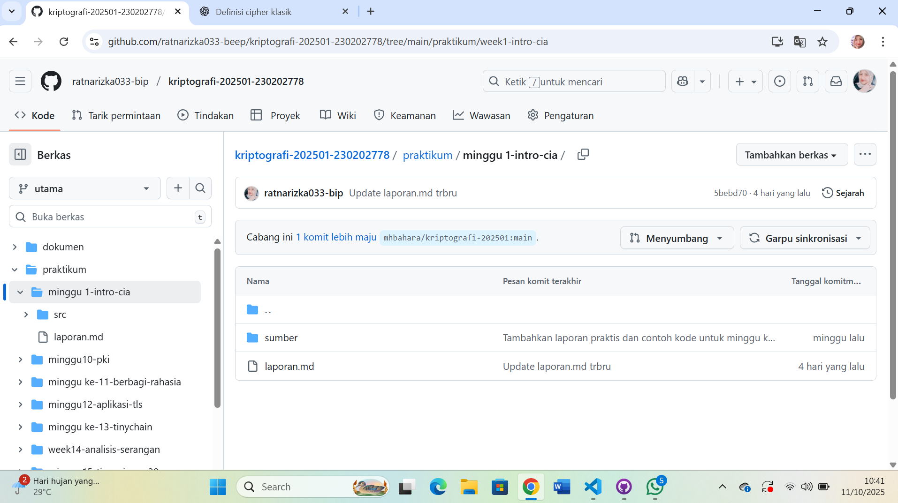
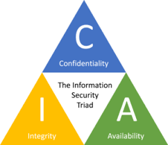

# Laporan Praktikum Kriptografi
Minggu ke-: 1
Topik: Sejarah Kriptografi & Prinsip CIA
Nama: Ratna Rizka Maharani
NIM: 230202778
Kelas: 5IKRB

---

## 1. Tujuan
- Menjelaskan tentang sejarah dan evolusi kriptogarfi dari masa klasik hingga masa modern.
- Menyebutkan tentang prinsip confidentiality, integrity , availabilty (CIA) dengan benar.
- Menyimpulkan peran kriptografi dalam sistem keamanan informasi modern.
- Menyiapkan mengenai repositori Github sebagai media  kerja praktikum.

---

## 2. Dasar Teori
Kriptografi adalah ilmu yang mempelajari tentang teknik untuk mengamankan pesan dengan cara menyandikan informasi sehingga tidak dapat dipahami oleh pihak yang tidak berwenang. Pada masa klasik, metode kriptografi sederhana seperti Caesar Cipher dan Vigenère Cipher digunakan untuk menyamarkan pesan kemudian Prinsip utama dari cipher klasik yaitu melakukan substitusi (penggantian huruf dengan huruf lain) atau transposisi (pertukaran posisi huruf) agar pesan asli (plaintext) sulit dibaca tanpa kunci tertentu.

Selain itu, kriptografi memanfaatkan konsep aritmetika modular dengan Operasi yang digunakan dalam berbagai algoritma enkripsi, baik klasik maupun modern. Contohnya, pada Caesar Cipher, setiap huruf di geser sejauh n posisi menggunakan perhitungan mod 26 (jumlah huruf alfabet). Prinsip ini juga menjadi dasar dalam sistem kriptografi modern seperti RSA yang menggunakan modulus bilangan prima sangat besar agar sulit dipecahkan.

Di era modern saat ini kriptografi tidak hanya fokus pada penyandian pesan, tetapi menjamin aspek Confidentiality, Integrity, dan Availability (CIA). Contohnya algoritma AES (Advanced Encryption Standard) untuk menjaga kerahasiaan data, sedangkan fungsi hash seperti SHA-256 dipergunakan untuk memastikan integritas data. Seiring perkembangan teknologi digital, kriptografi menjadi pilar utama dalam keamanan sistem informasi dan komunikasi internet, transaksi keuangan, setrta tanda tangan digital.

--- 

## 3. Alat dan Bahan
(- Python 3.12.10 
- Visual Studio Code / editor lain  
- Git dan akun GitHub  
- Library tambahan (misalnya pycryptodome, jika diperlukan)  )

---

## 4. Langkah Percobaan
(Tuliskan langkah yang dilakukan sesuai instruksi.  
Contoh format:
1. Membuat file `code.-example.py` di folder `praktikum/week1-intro-cia/src/`.
2. Menyalin kode program dari panduan praktikum.
3. Menjalankan program dengan perintah `python caesar_cipher.py`.)

---

## 5. Source Code
(Salin kode program utama yang dibuat atau dimodifikasi.  
Gunakan blok kode:

```python
# contoh potongan kode
def encrypt(text, key):
    return ...
```
)

---

## 6. Hasil dan Pembahasan
- Lampirkan screenshot hasil eksekusi program (taruh di folder `screenshots/`).  
- Berikan tabel atau ringkasan hasil uji jika diperlukan.  
- Jelaskan apakah hasil sesuai ekspektasi.  
- Bahas error (jika ada) dan solusinya. 

Bukti hasil repo dan contoh CIA:




---

## 7. Jawaban Pertanyaan
1. Siapa tokoh yang dianggap sebagai bapak kriptografi modern? 
jawab:bapak kriptografi modern adalah Claude E. Shannon.

2. Sebutkan algoritma kunci publik yang populer digunakan saat ini.  
jawab:RSA (Rivest–Shamir–Adleman), ElGamal, ECC (Elliptic Curve Cryptography), DSA (Digital Signature Algorithm), Diffie–Hellman Key Exchange

3. Apa perbedaan utama antara kriptografi klasik dan kriptografi modern?  
jawab:kriptografi klasik menggunakan operasi sederhana dengan substitusi dan transposisi pada huruf, dengan satu kunci yang sama yaitu enkripsi dan dekripsi. sedangkan
kriptografi modern menggunakan algoritma kompleks  dan bekerja pada bit atau blok data, dengan sistem kunci simetris ataupun sistematis yang jauh lebih aman.
---

## 8. Kesimpulan
Pada minggu pertama matakuliah kriptografi memberikan pemahaman mendalam tentang Sejarah Kriptografi dari era klasik hingga modern serta penerapan dalam kemanan digital. pentingnya menjaga keamanan data melalui teknik penyandian informasi. Mahasiswa mempelajari konsep dasar CIA untuk melindungi data dan sistem seperti enkripsi, dekripsi, kunci, cipher klasik, hingga penerapan kriptografi modern yang berbasis matematika dan algoritma kompleks. Pembelajaran ini menumbuhkan kesadaran akan pentingnya kerahasiaan, keaslian, dan integritas data dalam sistem informasi digital.

Selain itu, mata kuliah ini melatih kemampuan analitis mahasiswa dalam memahami cara kerja algoritma keamanan seperti AES, RSA, dan ECC yang digunakan dalam teknologi modern. Dengan memahami prinsip dasar kriptografi, mahasiswa diharapkan mampu menerapkan konsep keamanan informasi pada berbagai sistem digital, serta berkontribusi dalam pengembangan teknologi yang aman dan terpercaya di era siber saat ini.

---

## 9. Daftar Pustaka
- Katz, J., & Lindell, Y. *Introduction to Modern Cryptography*.  
- Stallings, W. *Cryptography and Network Security*.  
- Kessler, G. C. (2019). An Overview of Cryptography. In Handbook on Local Area Networks (pp. 1–23). CRC Press.
- Menezes, A. J., van Oorschot, P. C., & Vanstone, S. A. (1996). Handbook of Applied Cryptography. CRC Press.
---

## 10. Commit Log
commit abc12345
Author: Ratna Rizka Maharani <ratnarizka033@gmail.com>
Date:   RABU, 1 oktober 2025

    week1-intro-cia
```
