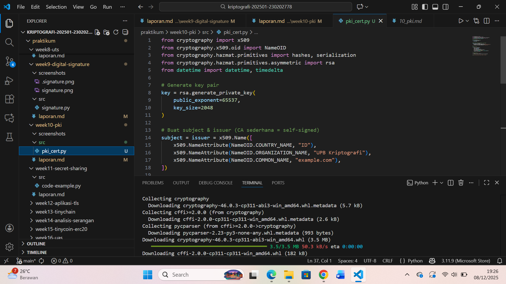
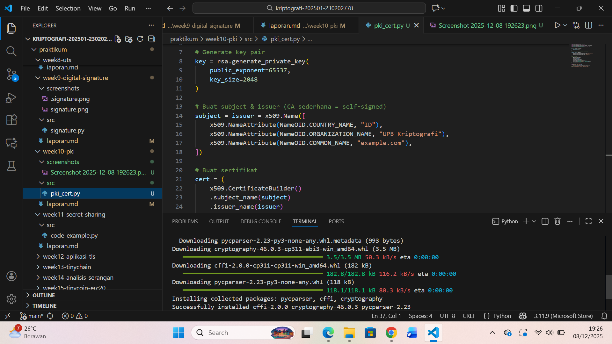
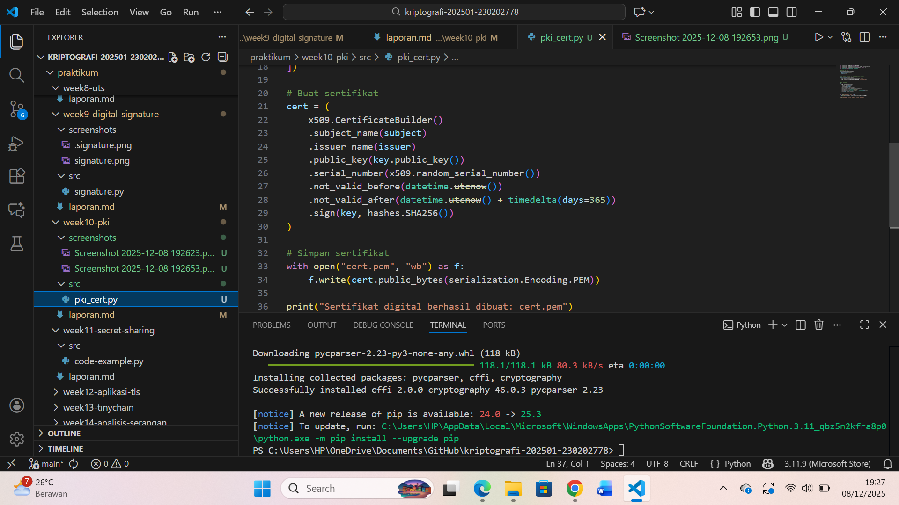

# Laporan Praktikum Kriptografi
Minggu ke-:  10
Topik: pki Public Key Infrastructure
Nama: Ratna Rizka Maharani
NIM: 230202778
Kelas: 5IKRB

---

## 1. Tujuan
Tujuan dari praktikum ini menurut saya adalah untuk memahami konsep dasar Public Key Infrastructure (PKI) dan bagaimana sistem ini digunakan untuk menyediakan keamanan dalam komunikasi digital modern. Mahasiswa diharapkan mampu membuat sertifikat digital sederhana menggunakan Python dan library cryptography sebagai simulasi Certificate Authority (CA) yang menerbitkan sertifikat. Selain itu, mahasiswa juga belajar menjelaskan proses validasi sertifikat digital serta peran CA dalam menjamin keaslian identitas dalam sebuah sistem komunikasi aman seperti HTTPS dan TLS.
Melalui praktikum ini, mahasiswa dapat mengevaluasi bagaimana PKI mencegah serangan seperti Man-in-the-Middle (MITM) dan mengapa sertifikat dari CA terpercaya sangat penting dalam lingkungan produksi.

---

## 2. Dasar Teori
Public Key Infrastructure (PKI) merupakan sebuah kerangka kerja teknologi yang digunakan untuk mengelola kunci publik, sertifikat digital, serta proses verifikasi identitas di dalam jaringan. PKI bekerja dengan memanfaatkan pasangan kunci asimetris, yaitu public key dan private key, yang digunakan untuk enkripsi, dekripsi, tanda tangan digital, serta proses autentikasi. Dalam sistem PKI, sertifikat digital dikeluarkan oleh lembaga terpercaya yang disebut Certificate Authority (CA). Sertifikat digital ini berisi informasi identitas pemilik, kunci publik, masa berlaku, dan tanda tangan digital CA.

Certificate Authority (CA) memiliki fungsi utama sebagai pihak yang dipercaya untuk memverifikasi identitas entitas, baik berupa server, pengguna, maupun perangkat. CA melakukan proses signing terhadap sertifikat sehingga browser atau sistem lain dapat memastikan bahwa sertifikat tersebut valid dan benar-benar diterbitkan oleh CA yang sudah terdaftar dalam trusted root store. Dengan cara ini, CA menjadi fondasi keamanan dalam komunikasi yang menggunakan TLS/HTTPS.

PKI berperan penting dalam mencegah serangan keamanan seperti penyadapan data, pemalsuan identitas, dan serangan Man-in-the-Middle (MITM), sehingga ketika sebuah koneksi HTTPS dilakukan, browser akan mengecek rantai kepercayaan (certificate chain) yang menunjukkan apakah sertifikat valid, belum kedaluwarsa, tidak dicabut, dan benar-benar ditandatangani oleh CA terpercaya. Tanpa keberadaan PKI, komunikasi di internet tidak dapat dijamin keamanannya dan rentan terhadap manipulasi data oleh pihak yang tidak berwenang.
---

## 3. Alat dan Bahan
(- Python 3.11 
- Visual Studio Code / editor lain  
- Git dan akun GitHub  
- Library tambahan (misalnya pycryptodome, jika diperlukan)  )

---

## 4. Langkah Percobaan
(Tuliskan langkah yang dilakukan sesuai instruksi.  
Contoh format:
1. Membuat file `pki_cert.py` di folder `praktikum/week10-pki_cert/src/`.
2. Menyalin kode program dari panduan praktikum.
3. Menjalankan program dengan perintah `python Public Key Infrastructure_pki.py`.)

---

## 5. Source Code
Python `cryptography`:
```python
from cryptography import x509
from cryptography.x509.oid import NameOID
from cryptography.hazmat.primitives import hashes, serialization
from cryptography.hazmat.primitives.asymmetric import rsa
from datetime import datetime, timedelta

# Generate key pair
key = rsa.generate_private_key(public_exponent=65537, key_size=2048)

# Buat subject & issuer (CA sederhana = self-signed)
subject = issuer = x509.Name([
    x509.NameAttribute(NameOID.COUNTRY_NAME, u"ID"),
    x509.NameAttribute(NameOID.ORGANIZATION_NAME, u"UPB Kriptografi"),
    x509.NameAttribute(NameOID.COMMON_NAME, u"example.com"),
])

# Buat sertifikat
cert = (
    x509.CertificateBuilder()
    .subject_name(subject)
    .issuer_name(issuer)
    .public_key(key.public_key())
    .serial_number(x509.random_serial_number())
    .not_valid_before(datetime.utcnow())
    .not_valid_after(datetime.utcnow() + timedelta(days=365))
    .sign(key, hashes.SHA256())
)

# Simpan sertifikat
with open("cert.pem", "wb") as f:
    f.write(cert.public_bytes(serialization.Encoding.PEM))

print("Sertifikat digital berhasil dibuat: cert.pem")
```

---

## 6. Hasil dan Pembahasan
(- Lampirkan screenshot hasil eksekusi program (taruh di folder `screenshots/`).  
- Berikan tabel atau ringkasan hasil uji jika diperlukan.  
- Jelaskan apakah hasil sesuai ekspektasi.  
- Bahas error (jika ada) dan solusinya. 

Hasil eksekusi program Caesar Cipher:




)

---

## 7. Jawaban Pertanyaan
Jawab pertanyaan diskusi yang diberikan pada modul.  
- 1. Apa fungsi utama Certificate Authority (CA)?
Jawab: Certificate Authority (CA) memiliki fungsi utama sebagai lembaga terpercaya yang bertugas memverifikasi identitas pemilik kunci publik sebelum menerbitkan sertifikat digital. CA memastikan bahwa individu, server, organisasi, atau perangkat yang meminta sertifikat benar-benar sesuai dengan identitas yang diklaim. Proses ini dilakukan melalui validasi dokumen, pemeriksaan domain, dan autentikasi administratif. Setelah identitas terverifikasi, CA menandatangani sertifikat digital menggunakan private key miliknya, sehingga sertifikat tersebut dapat dipercaya oleh sistem lain yang mengenali CA sebagai otoritas resmi. Dengan demikian, CA berperan sebagai "penjamin identitas" dalam komunikasi digital yang membutuhkan kepercayaan tinggi.

Selain memverifikasi identitas, CA juga berfungsi untuk menjaga integritas dan keamanan ekosistem PKI secara keseluruhan. CA tidak hanya menerbitkan sertifikat, tetapi juga bertanggung jawab untuk mengelola masa berlaku sertifikat, mencabut sertifikat yang sudah tidak valid, serta menyediakan Certificate Revocation List (CRL) atau layanan OCSP agar klien dapat memeriksa status sertifikat secara real time. Dengan adanya CA, browser dan sistem jaringan dapat memastikan bahwa sertifikat yang digunakan dalam protokol seperti HTTPS dan TLS benar-benar valid, tidak dipalsukan, serta berasal dari sumber terpercaya. Tanpa keberadaan CA, proses autentikasi digital akan sangat rentan terhadap penyalahgunaan dan serangan MITM.

- 2.  Mengapa self-signed certificate tidak cukup untuk sistem produksi?
Jawab: Self-signed certificate tidak mencukupi menurut saya karena tidak memiliki jaminan keaslian dari pihak ketiga yang terpercaya. Browser atau perangkat tidak memiliki alasan untuk mempercayai sertifikat tersebut karena tidak berasal dari CA resmi yang ada dalam trusted root store. Akibatnya, sertifikat self-signed tidak dapat digunakan untuk transaksi sensitif seperti perbankan, e-commerce, atau pertukaran data penting.

- 3. Bagaimana PKI mencegah serangan MITM dalam komunikasi TLS/HTTPS?
Jawab: PKI mencegah serangan Man-in-the-Middle (MITM) dengan menyediakan mekanisme autentikasi yang kuat berbasis sertifikat digital. Ketika sebuah perangkat atau browser mencoba terhubung ke server melalui HTTPS, server akan mengirimkan sertifikat digital yang berisi identitas dan kunci publiknya. Browser kemudian melakukan verifikasi terhadap sertifikat tersebut menggunakan rantai kepercayaan (certificate chain), yaitu memeriksa apakah sertifikat ditandatangani oleh Certificate Authority (CA) yang terpercaya dan apakah sertifikat tersebut masih valid. Jika ada perubahan atau pemalsuan pada sertifikat, tanda tangan digital CA tidak akan sesuai, sehingga browser otomatis menolak koneksi. Dengan cara ini, penyerang yang mencoba menyisipkan server palsu atau memanipulasi data tidak dapat menipu browser karena mereka tidak memiliki sertifikat sah yang ditandatangani CA resmi.

Selain itu, PKI juga menggunakan proses key exchange yang aman selama handshake TLS. Setelah sertifikat server tervalidasi, browser akan menghasilkan kunci sesi (session key) yang dienkripsi menggunakan kunci publik dari sertifikat tersebut. Hanya server asli yang memiliki private key yang dapat mendekripsi kunci sesi tersebut. Ini memastikan bahwa meskipun penyerang berada di tengah jalur komunikasi, mereka tidak dapat membaca atau mengubah data yang dipertukarkan karena tidak memiliki private key yang sesuai. Dengan kombinasi verifikasi identitas menggunakan sertifikat digital dan enkripsi kuat pada TLS, PKI memberikan perlindungan menyeluruh yang membuat serangan MITM menjadi sangat sulit untuk dilakukan pada koneksi HTTPS yang sah.

---

## 8. Kesimpulan
Pada praktikum ini, mahasiswa berhasil memahami konsep dasar Public Key Infrastructure (PKI) melalui pembuatan sertifikat digital sederhana menggunakan Python dan library cryptography. Proses pembuatan sertifikat self-signed memberikan gambaran langsung tentang bagaimana sebuah Certificate Authority (CA) menandatangani sertifikat serta bagaimana atribut penting seperti identitas, kunci publik, dan masa berlaku disusun dalam sebuah sertifikat digital. Meski self-signed certificate tidak digunakan dalam lingkungan produksi, percobaan ini efektif untuk memahami alur kerja dasar PKI dan bagaimana integritas sertifikat dijaga melalui tanda tangan digital yang tidak dapat dipalsukan tanpa private key yang sesuai.

Selain itu, praktikum ini juga menunjukkan betapa pentingnya PKI dalam menjaga keamanan komunikasi modern. PKI menjadi fondasi utama dalam protokol HTTPS dan TLS, terutama dalam mencegah serangan Man-in-the-Middle (MITM) melalui mekanisme autentikasi berbasis sertifikat dan verifikasi rantai kepercayaan. Dengan memahami proses pembuatan sertifikat dan peran CA, mahasiswa memperoleh insight mengenai bagaimana keaslian server atau entitas digital dapat divalidasi sebelum pertukaran data terenkripsi berlangsung. Dengan demikian, praktikum ini tidak hanya memberikan pengalaman teknis, tetapi juga memperkuat pemahaman konsep keamanan jaringan yang sangat krusial dalam dunia digital saat ini.

---

## 9. Daftar Pustaka
Cantumkan referensi yang digunakan.  
Contoh:  
- Katz, J., & Lindell, Y. *Introduction to Modern Cryptography*.  
- Stallings, W. *Cryptography and Network Security*.  
- Paar, C., & Pelzl, J. (2010). Understanding Cryptography: A Textbook for Students and Practitioners. Springer.
- Trappe, W., & Washington, L. C. (2006). Introduction to Cryptography with Coding Theory (2nd ed.). Pearson.
- Singh, S. (1999). The Code Book: The Science of Secrecy from Ancient Egypt to Quantum Cryptography. Anchor Books
- Menezes, A. J., van Oorschot, P. C., & Vanstone, S. A. (1996). Handbook of Applied Cryptography. CRC Press.
---

## 10. Commit Log
```
commit 9f2a3ce1
Author: Ratna Rizka Maharani <ratnarizka033@gmail.com>
Date:  Sabtu 06 Desember 2025

    week10-pki: implementasi Public Key Infrastructure dan laporan 
```
