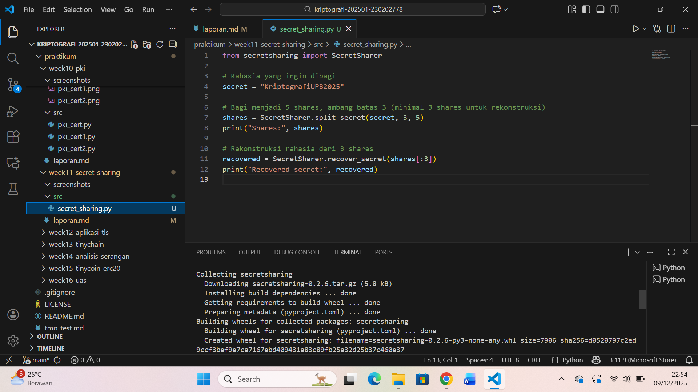

# Laporan Praktikum Kriptografi
Minggu ke-: 11
Topik: Secret-Sharing (Shamir’s Secret Sharing)  
Nama: Ratna Rizka Maharani 
NIM: 230202778
Kelas: 5IKRA

---

## 1. Tujuan
Jasi tujuan dari praktikum ini menurut saya adalah untuk memahami konsep dasar dari Shamir’s Secret Sharing (SSS) sebagai salah satu metode pembagian rahasia secara aman. Mahasiswa diharapkan mampu mengimplementasikan algoritma secret sharing menggunakan Python, baik dengan library maupun secara manual menggunakan operasi polinomial. Selain itu, mahasiswa diharapkan dapat melakukan rekonstruksi rahasia menggunakan sejumlah share tertentu serta menganalisis aspek keamanan dari mekanisme threshold pada skema SSS.
---

## 2. Dasar Teori
Secret-Sharing (Shamir’s Secret Sharing) merupakan sebuah metode kriptografi yang digunakan untuk membagi sebuah rahasia menjadi beberapa bagian (shares), sehingga rahasia tersebut hanya dapat dipulihkan jika sejumlah minimum bagian dikumpulkan kembali. Teknik ini diperkenalkan oleh Adi Shamir pada tahun 1979 sebagai solusi untuk membagi kunci rahasia secara aman kepada beberapa pihak tanpa risiko jika salah satu pihak kehilangan atau membocorkan bagiannya. Pendekatan ini termasuk dalam kategori (k, n)-threshold scheme, di mana suatu rahasia dibagi menjadi n bagian, dan rahasia tersebut hanya dapat direkonstruksi jika minimal k bagian dikumpulkan.

Metode Shamir bekerja menggunakan konsep interpolasi polinomial. Pada proses pembagian rahasia, sebuah polinomial acak orde (k–1) dibuat dengan rahasia sebagai konstanta utamanya. Setiap share adalah hasil dari evaluasi polinomial tersebut pada titik yang berbeda. Karena polinomial orde (k–1)dapat ditentukan secara unik oleh k titik, maka gabungan minimal k share memungkinkan pengguna untuk membangun kembali polinomial menggunakan metode interpolasi Lagrange, sehingga rahasia yang ditanamkan pada konstanta dapat diperoleh kembali. Sementara itu, jika jumlah share yang dikumpulkan kurang dari k, adalah informasi yang diperoleh tidak cukup untuk merekonstruksi rahasia.

Keunggulan utama Shamir’s Secret Sharing yaitu sifatnya yang information-theoretic secure, artinya bahkan dengan kemampuan komputasi tak terbatas, penyerang tidak dapat memperoleh rahasia hanya dari kurang dari k share. Selain itu, metode ini memberikan fleksibilitas dalam menentukan jumlah total share dan ambang batas k, sehingga cocok diterapkan pada berbagai skenario, seperti penyimpanan kunci kriptografi penting, sistem pemulihan bencana, hingga pengelolaan akses pada organisasi yang memerlukan persetujuan bersama. Keandalan dan ketahanannya terhadap kegagalan menjadikan Shamir’s Secret Sharing sebagai salah satu teknik wajib dalam sistem keamanan modern.

---

## 3. Alat dan Bahan
(- Python 3.11
- Visual Studio Code / editor lain  
- Git dan akun GitHub  
- Library tambahan (misalnya pycryptodome, jika diperlukan)  )

---

## 4. Langkah Percobaan
(Tuliskan langkah yang dilakukan sesuai instruksi.  
Contoh format:
1. Membuat file `secret_sharing.py` di folder `praktikum/week11-secret-sharing/src/`.
2. Menyalin kode program dari panduan praktikum.
3. Menjalankan program dengan perintah `python secret_sharing.py`.)

---

## 5. Source Code
library `secretsharing`:

```python
from secretsharing import SecretSharer

# Rahasia yang ingin dibagi
secret = "KriptografiUPB2025"

# Bagi menjadi 5 shares, ambang batas 3 (minimal 3 shares untuk rekonstruksi)
shares = SecretSharer.split_secret(secret, 3, 5)
print("Shares:", shares)

# Rekonstruksi rahasia dari 3 shares
recovered = SecretSharer.recover_secret(shares[:3])
print("Recovered secret:", recovered)
```
```

---

## 6. Hasil dan Pembahasan
(- Lampirkan screenshot hasil eksekusi program (taruh di folder `screenshots/`).  
- Berikan tabel atau ringkasan hasil uji jika diperlukan.  
- Jelaskan apakah hasil sesuai ekspektasi.  
- Bahas error (jika ada) dan solusinya. 

Hasil eksekusi program Caesar Cipher:




)

---

## 7. Jawaban Pertanyaan
(Jawab pertanyaan diskusi yang diberikan pada modul.  
- 1.Apa keuntungan utama Shamir Secret Sharing dibanding membagikan salinan kunci secara langsung?
jawab: Menurut saya Keuntungan utama Shamir’s Secret Sharing dibandingkan membagikan salinan kunci secara langsung adalah tingkat keamanannya yang jauh lebih tinggi. Ketika kunci dibagikan secara langsung dalam bentuk salinan, setiap orang yang memegang salinan tersebut memiliki kemampuan penuh untuk mengakses atau menyalahgunakan rahasia. Jika satu salinan dicuri, disalin ulang, atau bocor, maka seluruh sistem keamanan dapat runtuh. Sebaliknya, SSS membagi kunci menjadi beberapa share yang tidak berarti apa-apa jika dilihat secara terpisah. Satu share tidak memberikan informasi apa pun tentang rahasianya, sehingga meskipun ada pihak yang kehilangan atau membocorkan bagiannya, rahasia tetap aman karena diperlukan sejumlah threshold tertentu untuk merekonstruksinya.

Selain keamanan, SSS juga memberikan fleksibilitas dan kontrol akses yang jauh lebih baik. Dengan skema (k, n), organisasi dapat menentukan jumlah pemegang share dan jumlah minimal yang diperlukan untuk membuka kunci, menciptakan mekanisme multi-person authorization. Hal ini mencegah penyalahgunaan wewenang oleh satu individu dan memastikan bahwa keputusan penting—seperti membuka akses master key atau menjalankan operasi sensitif—harus dilakukan secara kolektif. Dengan kata lain, SSS tidak hanya melindungi rahasia, tetapi juga memperkuat governance, akuntabilitas, serta ketahanan sistem terhadap serangan maupun kegagalan internal.


- 2.Apa peran threshold (k) dalam keamanan secret sharing?
Jawab: Peran Threshold dalam keamanan secret sharing yaitu untuk menentukan jumlah minimal share yang harus dikombinasikan untuk merekonstruksi rahasia. Jika kurang dari k share tersedia, secara matematis rahasia tidak mungkin dipulihkan karena polinomial masih memiliki tak hingga kemungkinan. Nilai threshold berperan sebagai pengatur tingkat keamanan dan ketersediaan rahasia.

- 3.Berikan satu contoh skenario nyata di mana SSS sangat bermanfaat.
Jawab: Dalam sebuah bank digital modern, terdapat satu *master key* yang digunakan untuk mengenkripsi dan melindungi seluruh data sensitif nasabah, mulai dari informasi rekening, transaksi, hingga autentikasi antarserver. Kunci ini merupakan pusat dari seluruh sistem keamanan; apabila hilang atau jatuh ke tangan pihak yang salah, bank dapat mengalami kerugian besar, data bisa bocor, dan seluruh operasional keamanan dapat runtuh. Karena itu, tidak mungkin hanya satu orang yang menyimpan atau bertanggung jawab atas master key tersebut. Di sinilah Shamir’s Secret Sharing memberikan solusi yang sangat efektif.

Bank kemudian menerapkan mekanisme **(k, n) threshold scheme**, misalnya *(3, 7)*, artinya master key dibagi menjadi 7 bagian dan minimal 3 orang harus hadir untuk merekonstruksi kunci tersebut. Bagian-bagian ini kemudian dibagikan kepada pejabat-pejabat penting seperti Kepala Keamanan Informasi (CISO), Direktur TI, manajer pusat data, auditor internal, dan pihak-pihak yang memiliki otoritas tinggi. Dengan cara ini, tidak ada satu orang pun yang memiliki akses penuh terhadap kunci utama. Bahkan jika salah satu bagian hilang atau dicuri, hal itu tidak akan membahayakan sistem karena share tunggal tidak memberikan informasi apa pun tentang master key.

Penerapan ini sangat berguna dalam situasi darurat, misalnya ketika terjadi *system failure*, serangan siber besar, atau keperluan pemulihan pusat data (disaster recovery). Ketika sistem membutuhkan master key untuk membuka akses ke data terenkripsi, setidaknya tiga pemegang share harus hadir secara fisik atau melalui autentikasi tingkat tinggi untuk merekonstruksi kembali kunci tersebut. Proses ini menciptakan *multi-person control* yang mencegah penyalahgunaan wewenang, tindakan insider threat, dan mengurangi risiko korupsi atau sabotase internal.

Selain itu, penggunaan SSS dalam skenario ini juga memberikan transparansi dan akuntabilitas yang lebih tinggi. Setiap kali proses rekonstruksi dilakukan, sistem mencatat identitas pemegang share yang terlibat, sehingga menciptakan jejak audit digital yang kuat. Dengan demikian, Shamir’s Secret Sharing tidak hanya melindungi data dari sisi teknis, tetapi juga mendukung pengawasan administratif dan kepatuhan terhadap standar keamanan internasional seperti ISO 27001 atau PCI-DSS.

Skenario ini menunjukkan bahwa SSS bukan hanya teori matematika, tetapi merupakan solusi praktis yang sangat penting dalam menjaga keamanan organisasi dengan struktur kompleks. Dengan memastikan bahwa akses terhadap rahasia kritis tidak berada pada satu orang, bank atau perusahaan besar dapat mengurangi risiko kebocoran data, meningkatkan keamanan, dan memperkuat kepercayaan pengguna terhadap layanan mereka.

)
---

## 8. Kesimpulan
Praktikum ini berhasil menunjukkan bagaimana Shamir’s Secret Sharing bekerja dalam membagi dan merekonstruksi sebuah rahasia menggunakan pendekatan threshold. Program yang dibuat berhasil menghasilkan beberapa share dan mengembalikan rahasia ketika jumlah share memenuhi syarat. Secara keseluruhan, SSS merupakan metode yang sangat aman dan efektif untuk pengelolaan rahasia dalam sistem keamanan modern.

Selain itu, praktikum ini juga memberikan pemahaman yang lebih nyata mengenai bagaimana konsep matematika seperti polinomial dan interpolasi Lagrange diterapkan langsung dalam dunia kriptografi. Melalui implementasi program, terlihat bahwa perubahan nilai threshold maupun jumlah share dapat memengaruhi fleksibilitas dan tingkat keamanan sistem. Dengan demikian, mahasiswa tidak hanya memahami teori Secret Sharing secara abstrak, tetapi juga melihat bagaimana mekanisme tersebut bekerja secara teknis dalam proses pembangkitan share dan rekonstruksi rahasia. Praktikum ini menunjukkan bahwa Shamir’s Secret Sharing sangat relevan sebagai dasar dalam membangun sistem keamanan data yang membutuhkan kolaborasi dan kontrol akses terdistribusi.

---

## 9. Daftar Pustaka
(Cantumkan referensi yang digunakan.  
Contoh:  
- Katz, J., & Lindell, Y. *Introduction to Modern Cryptography*.  
- Stallings, W. *Cryptography and Network Security*.  )
Stinson, D. R. (2019). Cryptography: Theory and Practice.
- Shamir, A. (1979). “How to Share a Secret.” Communications of the ACM.
- Trappe, W., & Washington, L. C. (2006). Introduction to Cryptography with Coding Theory (2nd ed.). Pearson.
- Singh, S. (1999). The Code Book: The Science of Secrecy from Ancient Egypt to Quantum Cryptography. Anchor Books
- Menezes, A. J., van Oorschot, P. C., & Vanstone, S. A. (1996). Handbook of Applied Cryptography. CRC Press.
---

## 10. Commit Log
```
commit 9f21ab3
Author: Ratna Rizka Maharani <ratnarizka033gmail.com>
Date:   Selasa 09 Desember 2025

    week11-secret-sharing: implementasi Secret-Sharing (Shamir’s Secret Sharing) dan laporan 
```
