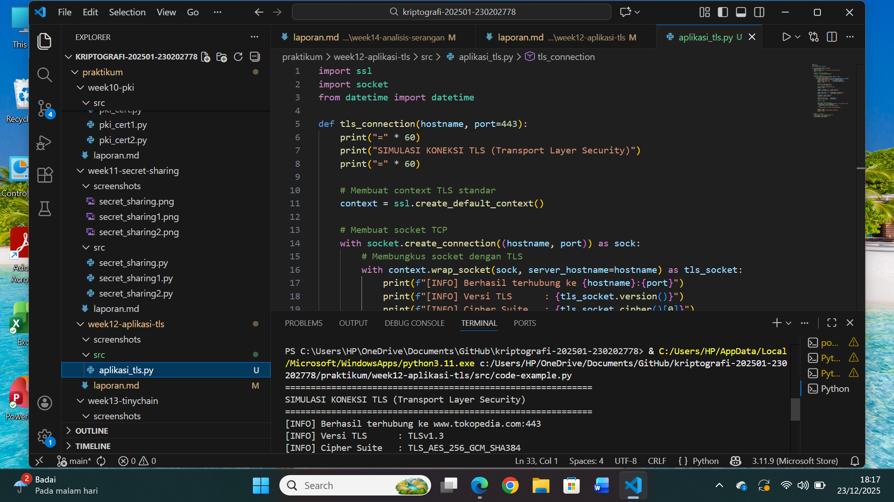
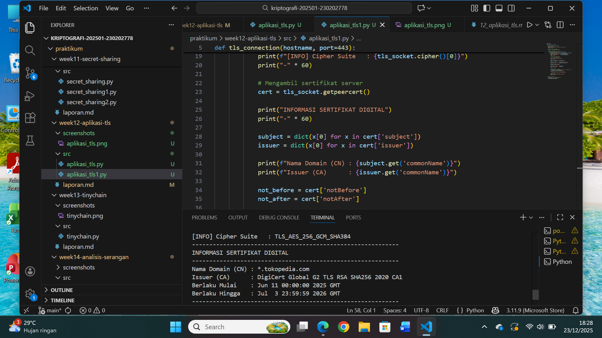
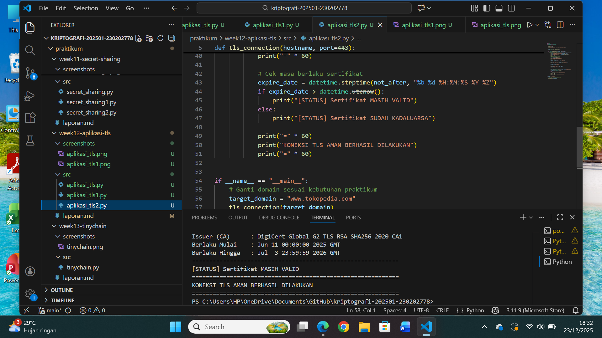

# Laporan Praktikum Kriptografi
Minggu ke-: 12
Topik: aplikasi tls (Transport Layer Security)
Nama: Ratna Rizka Maharani  
NIM: 230202778
Kelas: 5ikra

---

## 1. Tujuan
Tujuan praktikum ini menurut saya yaitu untuk memahami konsep dasar komunikasi aman menggunakan protokol Transport Layer Security (TLS) dan bagaimana TLS digunakan pada aplikasi modern seperti HTTPS. Mahasiswa diharapkan mampu menganalisis proses handshake, pertukaran kunci, serta enkripsi dan autentikasi yang terjadi selama sesi TLS berlangsung. Selain itu, mahasiswa mampu melakukan simulasi koneksi TLS menggunakan Python, mengamati sertifikat digital, dan mengevaluasi manfaat TLS dalam melindungi data.
---

## 2. Dasar Teori
Transport Layer Security (TLS) merupakan protokol keamanan standar yang digunakan untuk mengamankan komunikasi di jaringan komputer. TLS bekerja dengan memastikan tiga aspek utama: confidentiality (kerahasiaan), integrity (integritas), dan authenticity (autentikasi). Dengan TLS, data yang dikirimkan antara client dan server akan dienkripsi sehingga tidak dapat dibaca oleh pihak yang tidak berwenang.

Pada prosesnya, TLS dimulai dengan TLS Handshake, yakni fase di mana client dan server saling bertukar informasi kriptografi. Handshake mencakup pertukaran versi TLS, cipher suites, sertifikat digital server, dan pembuatan session key melalui algoritma seperti RSA atau Diffie-Hellman. Setelah handshake berhasil, komunikasi aman menggunakan symmetric encryption seperti AES.

Selain itu, TLS juga berperan penting dalam membangun kepercayaan antara client dan server melalui penggunaan sertifikat digital yang dikeluarkan oleh Certificate Authority (CA). Sertifikat ini memungkinkan client memverifikasi identitas server sehingga mencegah serangan seperti man-in-the-middle. Dengan adanya mekanisme enkripsi dan autentikasi yang kuat, TLS banyak diterapkan pada berbagai layanan internet modern, seperti HTTPS pada web, email, dan aplikasi berbasis cloud. Hal ini menjadikan TLS sebagai fondasi utama dalam menjaga keamanan, privasi, dan keandalan pertukaran data di era digital.

---

## 3. Alat dan Bahan
(- Python 3.12.10
- Visual Studio Code / editor lain  
- Git dan akun GitHub  
- Library tambahan (misalnya pycryptodome, jika diperlukan)  )

---

## 4. Langkah Percobaan
(Tuliskan langkah yang dilakukan sesuai instruksi.  
Contoh format:
1. Membuat file `aplikasi_tls.py` di folder `praktikum/``week12-aplikasi-tls``/src/`.
2. Menyalin kode program dari panduan praktikum.
3. Menjalankan program dengan perintah `python aplikasi_tls.py`.)

---

## 5. Source Code


```python
# contoh potongan kode
def encrypt(text, key):
    return ...
import ssl
import socket
from datetime import datetime

def tls_connection(hostname, port=443):
    print("=" * 60)
    print("SIMULASI KONEKSI TLS (Transport Layer Security)")
    print("=" * 60)

    # Membuat context TLS standar
    context = ssl.create_default_context()

    # Membuat socket TCP
    with socket.create_connection((hostname, port)) as sock:
        # Membungkus socket dengan TLS
        with context.wrap_socket(sock, server_hostname=hostname) as tls_socket:
            print(f"[INFO] Berhasil terhubung ke {hostname}:{port}")
            print(f"[INFO] Versi TLS      : {tls_socket.version()}")
            print(f"[INFO] Cipher Suite   : {tls_socket.cipher()[0]}")
            print("-" * 60)

            # Mengambil sertifikat server
            cert = tls_socket.getpeercert()

            print("INFORMASI SERTIFIKAT DIGITAL")
            print("-" * 60)

            subject = dict(x[0] for x in cert['subject'])
            issuer = dict(x[0] for x in cert['issuer'])

            print(f"Nama Domain (CN) : {subject.get('commonName')}")
            print(f"Issuer (CA)      : {issuer.get('commonName')}")

            not_before = cert['notBefore']
            not_after = cert['notAfter']

            print(f"Berlaku Mulai    : {not_before}")
            print(f"Berlaku Hingga   : {not_after}")

            print("-" * 60)

            # Cek masa berlaku sertifikat
            expire_date = datetime.strptime(not_after, "%b %d %H:%M:%S %Y %Z")
            if expire_date > datetime.utcnow():
                print("[STATUS] Sertifikat MASIH VALID")
            else:
                print("[STATUS] Sertifikat SUDAH KADALUARSA")

            print("=" * 60)
            print("KONEKSI TLS AMAN BERHASIL DILAKUKAN")
            print("=" * 60)


if __name__ == "__main__":
    # Ganti domain sesuai kebutuhan praktikum
    target_domain = "www.tokopedia.com"
    tls_connection(target_domain)


## 6. Hasil dan Pembahasan
- Lampirkan screenshot hasil eksekusi program taruh di folder `## 6. Hasil dan Pembahasan
- Lampirkan screenshot hasil eksekusi program (taruh di folder 'screenshots/`).  
- Berikan tabel atau ringkasan hasil uji jika diperlukan.  
- Jelaskan apakah hasil sesuai ekspektasi.  
- Bahas error (jika ada) dan solusinya. 

Hasil eksekusi program Caesar Cipher:






-

## 7. Jawaban Pertanyaan
(Jawab pertanyaan diskusi yang diberikan pada modul.  
- 1. Mengapa TLS penting dalam komunikasi internet
Jawab: Transport Layer Security TLS sangat penting dalam komunikasi internet karena protokol ini bertugas menjaga kerahasiaan, integritas, dan autentikasi data yang dikirimkan antar perangkat. Tanpa TLS, seluruh informasi yang dikirim melalui jaringan dapat dengan mudah disadap, diubah, atau dipalsukan oleh pihak tidak bertanggung jawab misalnya attacker yang melakukan man-in-the-middle). TLS memastikan bahwa data dienkripsi sebelum dikirim, sehingga meskipun pihak lain mampu menangkap paket tersebut, mereka tidak akan dapat membaca isi informasinya. Selain itu, TLS menyediakan mekanisme verifikasi identitas server, sehingga pengguna dapat memastikan bahwa mereka terhubung ke pihak yang benar, bukan ke penyerang. Karena hampir semua aktivitas digital—mulai dari login, transaksi e-commerce, hingga pertukaran data penting—bergantung pada keamanan komunikasi, penggunaan TLS menjadi fondasi utama keamanan internet modern.

- 2. Apa fungsi sertifikat digital dalam TLS
Jawab: Sertifikat digital berfungsi sebagai identitas resmi suatu server atau entitas dalam proses komunikasi TLS. Sertifikat ini diterbitkan oleh Certificate Authority (CA) terpercaya dan mengandung informasi penting seperti nama domain, kunci publik, serta tanda tangan digital dari CA. Dalam proses handshake TLS, browser atau client akan memeriksa sertifikat tersebut untuk memastikan bahwa server yang dihubungi benar-benar valid dan bukan server palsu yang dibuat oleh penyerang. Jika sertifikat tidak valid atau dipalsukan, TLS akan memberikan peringatan dan menghentikan koneksi. Selain memberikan autentikasi, sertifikat digital juga menjadi dasar pertukaran kunci rahasia yang digunakan dalam proses enkripsi selama sesi komunikasi. Dengan demikian, sertifikat digital adalah elemen inti yang memungkinkan TLS bekerja secara aman dan terpercaya.

- 3. Mengapa HTTPS lebih aman dibanding HTTP
jawab: HTTPS lebih aman dibandingkan HTTP karena menggunakan protokol SSL/TLS untuk mengenkripsi data yang dikirimkan antara client dan server. Dengan adanya enkripsi, informasi sensitif seperti username, password, data pribadi, dan informasi pembayaran tidak dapat dibaca atau dimodifikasi oleh pihak ketiga yang tidak berwenang, meskipun data tersebut berhasil disadap di tengah perjalanan jaringan. Sebaliknya, HTTP mengirimkan data dalam bentuk teks biasa (plaintext), sehingga sangat rentan terhadap serangan penyadapan (sniffing) dan pencurian data.

Selain enkripsi, HTTPS juga menyediakan mekanisme autentikasi dan integritas data melalui sertifikat digital. Sertifikat ini memastikan bahwa pengguna benar-benar terhubung ke server yang sah, sehingga mengurangi risiko serangan man-in-the-middle dan pemalsuan situs web. Integritas data menjamin bahwa informasi yang dikirim tidak diubah selama proses transmisi. Dengan kombinasi enkripsi, autentikasi, dan integritas tersebut, HTTPS memberikan tingkat keamanan yang jauh lebih tinggi dibandingkan HTTP dan menjadi standar wajib dalam komunikasi web modern.

)


## 8. Kesimpulan
Berdasarkan percobaan kesimpulan yang saya dapatkan yaitu bahwa TLS merupakan protokol vital dalam pengamanan komunikasi internet modern. Program Python yang dijalankan berhasil menunjukkan proses koneksi aman, pengambilan sertifikat digital, serta penggunaan enkripsi TLS. Dengan demikian, mahasiswa memahami bagaimana TLS bekerja dalam sistem nyata seperti HTTPS dan mengapa protokol ini sangat penting dalam menjaga keamanan data.

Selain itu, praktikum ini juga memperlihatkan bagaimana proses verifikasi sertifikat dan negosiasi cipher suite dilakukan secara otomatis oleh protokol, sehingga pengguna dapat memastikan integritas dan autentikasi server tanpa perlu melakukan konfigurasi manual. Melalui simulasi dan analisis hasil eksekusi program, mahasiswa dapat memahami potensi ancaman seperti serangan man-in-the-middle ketika sertifikat tidak valid, serta menyadari pentingnya peran Certificate Authority (CA) dalam ekosistem TLS. Dengan pemahaman ini, mahasiswa lebih siap menerapkan konsep keamanan jaringan pada aplikasi nyata dan mampu mengevaluasi apakah suatu koneksi benar-benar aman atau tidak.


## 9. Daftar Pustaka
(Cantumkan referensi yang digunakan.  
Contoh:  
- Katz, J., & Lindell, Y. *Introduction to Modern Cryptography*.  
- Stallings, W. *Cryptography and Network Security*.  )
- Shamir, A. (1979). “How to Share a Secret.” Communications of the ACM.
- Trappe, W., & Washington, L. C. (2006). Introduction to Cryptography with Coding Theory ( ed.). Pearson.
- Singh, S. (1999). The Code Book: The Science of Secrecy from Ancient Egypt to Quantum Cryptography. Anchor Books
- Menezes, A. J., van Oorschot, P. C., & Vanstone, S. A. (1996). Handbook of Applied Cryptography. CRC Press.


## 10. Commit Log
Tuliskan bukti commit Git yang relevan.  
Contoh:
```
commit 8ac93f1c2d9a12ab4d22faa11c8e9b331f20ae77
Author: Ratna Rizka Maharani <ratnarizka033gmail.com>
Date:   Friday 12 desember 2025 pukul 13.59

    week12-aplikasi-tls: implementasi aplikasi tls (Transport Layer Security) dan laporan 
```
