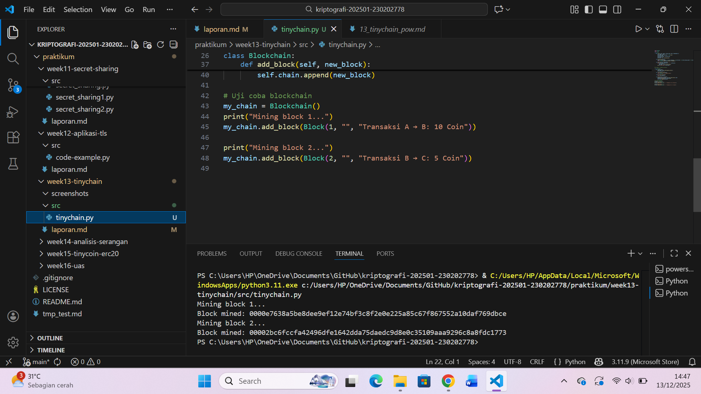

# Laporan Praktikum Kriptografi
Minggu ke-: 13  
Topik: TinyChain – Proof of Work (PoW)
Nama: RATNA RIZKA MAHARANI 
NIM: 230202778  
Kelas: 5IKRA

---

## 1. Tujuan
Tujuan dari praktikum TinyChain ini menurut saya yaitu untuk memahami konsep dasar sistem rantai blok (chain) dalam skala sederhana melalui simulasi yang disebut TinyChain. TinyChain dirancang sebagai versi ringan dari blockchain yang bertujuan edukatif, sehingga mahasiswa dapat memahami mekanisme dasar seperti pembuatan blok, penggunaan fungsi hash, serta proses Proof of Work (PoW) tanpa kompleksitas sistem blockchain sesungguhnya.

Selain itu, praktikum ini bertujuan untuk melatih mahasiswa dalam mengimplementasikan konsep kriptografi menggunakan bahasa pemrograman Python, khususnya dalam membangun struktur data, melakukan hashing, serta memahami bagaimana keamanan data dijaga melalui mekanisme komputasi. Dengan mempelajari TinyChain, mahasiswa diharapkan mampu memahami alur kerja blockchain sebelum mempelajari sistem yang lebih kompleks seperti Bitcoin atau Ethereum.
---

## 2. Dasar Teori
TinyChain merupakan representasi sederhana dari teknologi blockchain yang digunakan untuk tujuan pembelajaran. Dalam TinyChain, setiap blok berisi data transaksi, hash dari blok sebelumnya, serta nilai nonce yang digunakan dalam proses Proof of Work.

Fungsi hash memiliki peran penting dalam TinyChain. Hash berfungsi sebagai sidik jari digital yang unik untuk setiap blok. Perubahan sekecil apa pun pada data akan menghasilkan nilai hash yang berbeda secara signifikan. Hal ini membuat manipulasi data menjadi sangat sulit karena perubahan pada satu blok akan memengaruhi seluruh rantai blok berikutnya.

Proof of Work (PoW) merupakan mekanisme konsensus yang digunakan untuk menentukan apakah suatu blok sah untuk ditambahkan ke dalam rantai. Pada TinyChain, PoW dilakukan dengan mencari nilai nonce sehingga hasil hash memenuhi kriteria tertentu, misalnya diawali dengan sejumlah angka nol. Proses ini membutuhkan percobaan berulang (brute force) sehingga membutuhkan waktu dan sumber daya komputasi.

Melalui TinyChain, konsep keamanan seperti integritas data, keaslian informasi, dan ketahanan terhadap manipulasi dapat dipahami secara praktis meskipun sistemnya jauh lebih sederhana dibandingkan blockchain sesungguhnya.

---

## 3. Alat dan Bahan
(- Python 3.12.10
- Visual Studio Code / editor lain  
- Git dan akun GitHub  
- Library tambahan (misalnya pycryptodome, jika diperlukan)  )

---

## 4. Langkah Percobaan
(Tuliskan langkah yang dilakukan sesuai instruksi.  
Contoh format:
1. Membuat file `tinychain.py` di folder `praktikum/week13-tinychain/src/`.
2. Menyalin kode program dari panduan praktikum.
3. Menjalankan program dengan perintah `python tinychain.py`.)

---

## 5. Source Code
Salin kode program utama yang dibuat atau dimodifikasi.  
Gunakan blok kode:

```python
import hashlib
import time

class Block:
    def __init__(self, index, previous_hash, data, timestamp=None):
        self.index = index
        self.timestamp = timestamp or time.time()
        self.data = data
        self.previous_hash = previous_hash
        self.nonce = 0
        self.hash = self.calculate_hash()

    def calculate_hash(self):
        value = str(self.index) + str(self.timestamp) + str(self.data) + str(self.previous_hash) + str(self.nonce)
        return hashlib.sha256(value.encode()).hexdigest()

    def mine_block(self, difficulty):
        while self.hash[:difficulty] != "0" * difficulty:
            self.nonce += 1
            self.hash = self.calculate_hash()
        print(f"Block mined: {self.hash}")
```

---

### Langkah 2 — Membuat Blockchain
```python
class Blockchain:
    def __init__(self):
        self.chain = [self.create_genesis_block()]
        self.difficulty = 4

    def create_genesis_block(self):
        return Block(0, "0", "Genesis Block")

    def get_latest_block(self):
        return self.chain[-1]

    def add_block(self, new_block):
        new_block.previous_hash = self.get_latest_block().hash
        new_block.mine_block(self.difficulty)
        self.chain.append(new_block)

# Uji coba blockchain
my_chain = Blockchain()
print("Mining block 1...")
my_chain.add_block(Block(1, "", "Transaksi A → B: 10 Coin"))

print("Mining block 2...")
my_chain.add_block(Block(2, "", "Transaksi B → C: 5 Coin"))
```


---

## 6. Hasil dan Pembahasan
(- Lampirkan screenshot hasil eksekusi program (taruh di folder `screenshots/`).  
- Berikan tabel atau ringkasan hasil uji jika diperlukan.  
- Jelaskan apakah hasil sesuai ekspektasi.  
- Bahas error (jika ada) dan solusinya. 

Hasil eksekusi program Caesar Cipher:




)

---

## 7. Jawaban Pertanyaan
1. Mengapa fungsi hash sangat penting dalam blockchain?  
Jawab: Fungsi hash sangat penting dalam blockchain karena berperan sebagai pengaman utama data yang tersimpan di dalam blok. Setiap blok memiliki hash unik yang dihasilkan dari data transaksi dan hash blok sebelumnya. Jika satu data saja diubah, maka nilai hash akan berubah secara signifikan sehingga rantai blok menjadi tidak valid. Hal ini membuat blockchain bersifat immutabel (tidak mudah diubah). Selain itu, fungsi hash juga memastikan integritas data, menjaga keamanan transaksi, serta digunakan dalam proses validasi seperti Proof of Work untuk menentukan keabsahan blok baru.

2. Bagaimana Proof of Work mencegah double spending? 
Jawab: Proof of Work (PoW) mencegah double spending dengan mewajibkan setiap transaksi diverifikasi dan dimasukkan ke dalam blok yang harus disetujui oleh jaringan melalui proses penambangan. Penambang harus memecahkan persoalan kriptografi yang sulit sebelum sebuah blok dapat ditambahkan ke blockchain. Setelah transaksi tercatat dalam blok dan dikonfirmasi oleh mayoritas jaringan, transaksi tersebut tidak dapat diubah atau digunakan kembali. Jika seseorang mencoba melakukan double spending, jaringan akan menolak transaksi tersebut karena tidak sesuai dengan rantai terpanjang dan sah.

3. Apa kelemahan dari PoW dalam hal efisiensi energi?  
Jawab: Kelemahan utama Proof of Work adalah konsumsi energi yang sangat besar. Proses penambangan membutuhkan perangkat keras berdaya tinggi yang bekerja terus-menerus untuk menyelesaikan perhitungan matematika kompleks. Akibatnya, PoW memerlukan listrik dalam jumlah besar, meningkatkan biaya operasional, dan berdampak negatif terhadap lingkungan. Selain itu, sistem ini cenderung menguntungkan pihak yang memiliki sumber daya komputasi besar, sehingga berpotensi menimbulkan sentralisasi penambangan.


---

## 8. Kesimpulan
 Jadi kesimpulannya yaitu dari TinyChain merupakan media pembelajaran yang efektif untuk memahami prinsip dasar teknologi blockchain, khususnya mekanisme Proof of Work dan penggunaan fungsi hash. Melalui simulasi ini, mahasiswa dapat memahami bagaimana sebuah blok dibuat, bagaimana data diamankan, serta bagaimana proses validasi dilakukan sebelum sebuah blok ditambahkan ke dalam rantai. Meskipun bersifat sederhana, TinyChain memberikan gambaran nyata mengenai cara kerja blockchain dan menjadi dasar penting sebelum mempelajari sistem blockchain berskala besar yang digunakan pada dunia nyata.
---

## 9. Daftar Pustaka
(Cantumkan referensi yang digunakan.  
Contoh:  
- Katz, J., & Lindell, Y. *Introduction to Modern Cryptography*.  
- Stallings, W. *Cryptography and Network Security*.  )
- Shamir, A. (1979). “How to Share a Secret.” Communications of the ACM.
- Trappe, W., & Washington, L. C. (2006). Introduction to Cryptography with Coding Theory (2nd ed.). Pearson.
- Singh, S. (1999). The Code Book: The Science of Secrecy from Ancient Egypt to Quantum Cryptography. Anchor Books
- Menezes, A. J., van Oorschot, P. C., & Vanstone, S. A. (1996). Handbook of Applied Cryptography. CRC Press.
---

## 10. Commit Log
(Tuliskan bukti commit Git yang relevan.  
Contoh:
```
commit abcdef123456
Author: Ratna Rizka Maharani <ratnarizka033@gmail.com>
Date: saturday, 13 desember 2025 pukul 14.57

    week13-tinychain: implementasi tinychain dan laporan )
```
