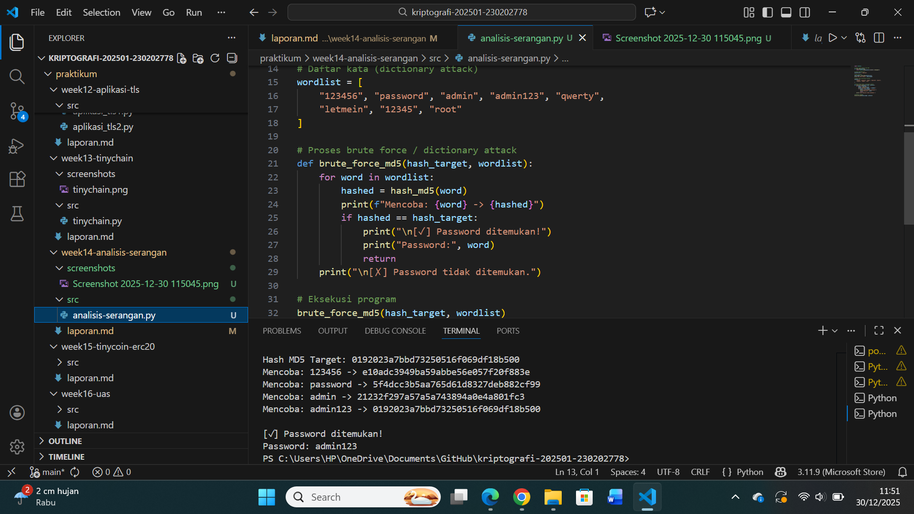

# Laporan Praktikum Kriptografi
Minggu ke-: 14
Topik: Analisis Serangan Kriptografi 
Nama: Ratna Rizka Maharani
NIM: 230202778
Kelas: 5IKRA

---

## 1. Tujuan
(Tuliskan tujuan pembelajaran praktikum sesuai modul.)
Tujuan dari saya praktikum analisis Serangan Kriptografi ini untuk memberikan pemahaman yang mendalam kepada mahasiswa mengenai berbagai jenis serangan yang dapat terjadi pada sistem kriptografi dalam dunia nyata. Melalui praktikum ini, mahasiswa diharapkan mampu mengidentifikasi bentuk serangan kriptografi yang umum, seperti brute force attack, dictionary attack, dan man-in-the-middle attack, juga memahami bagaimana serangan tersebut dapat mengeksploitasi kelemahan sistem keamanan.

Selain itu, praktikum ini bertujuan untuk melatih kemampuan mahasiswa dalam menganalisis sumber kerentanan, baik yang berasal dari kelemahan algoritma kriptografi itu sendiri maupun dari kesalahan implementasi dan konfigurasi sistem. Dengan demikian, mahasiswa tidak hanya memahami teori kriptografi, tetapi juga mampu mengevaluasi penerapannya secara kritis dalam sistem informasi.

Tujuan akhir dari praktikum ini adalah agar mahasiswa mampu memberikan rekomendasi solusi keamanan yang tepat dan relevan, seperti pemilihan algoritma kriptografi yang lebih kuat, penerapan konfigurasi keamanan yang benar serta penggunaan best practice keamanan modern untuk meningkatkan perlindungan sistem informasi terhadap serangan siber.
---

## 2. Dasar Teori
Kriptografi merupakan ilmu yang mempelajari teknik pengamanan informasi dengan cara mengubah data menjadi bentuk yang tidak dapat dipahami oleh pihak yang tidak berwenang. Tujuan utama kriptografi meliputi kerahasiaan (confidentiality), integritas (integrity), autentikasi (authentication), dan non-repudiation, sehingga dalam sistem informasi modern, kriptografi digunakan secara luas pada proses autentikasi pengguna, penyimpanan password, komunikasi jaringan, serta perlindungan data sensitif.

Namun, seiring berkembangnya teknologi komputasi, berbagai algoritma kriptografi lama mulai menunjukkan kelemahannya sepertyi Algoritma hash seperti MD5 dan SHA-1, yang dahulu dianggap aman, kini terbukti rentan terhadap serangan brute force dan collision attack. Serangan brute force bekerja dengan mencoba semua kemungkinan kombinasi kunci atau password hingga menemukan yang cocok, sedangkan dictionary attack menggunakan daftar kata sandi umum untuk mempercepat proses pencarian.

Selain kelemahan algoritmanya banyak serangan kriptografi juga terjadi akibat kesalahan implementasi. Contohnya adalah penyimpanan password tanpa salt, penggunaan panjang kunci yang terlalu pendek, serta konfigurasi protokol keamanan yang tidak tepat. Oleh karena itu, analisis serangan kriptografi tidak hanya berfokus pada algoritma yang digunakan, tetapi juga pada bagaimana algoritma tersebut diimplementasikan dalam sistem nyata.
---

## 3. Alat dan Bahan
(- Python 3.12.10
- Visual Studio Code / editor lain  
- Git dan akun GitHub  
- Library tambahan (misalnya pycryptodome, jika diperlukan)  )

---

## 4. Langkah Percobaan
(Tuliskan langkah yang dilakukan sesuai instruksi.  
Contoh format:
1. Membuat file `week14-analisis-serangan.py` di folder `praktikum.m/week14-analisis-serangansrc/`.
2. Menyalin kode program dari panduan praktikum.
3. Menjalankan program dengan perintah `python week14-analisis_serangan.py`.)

---

## 5. Source Code
(Salin kode program utama yang dibuat atau dimodifikasi.  
Gunakan blok kode:

```python
import hashlib

# Fungsi untuk membuat hash MD5
def hash_md5(password):
    return hashlib.md5(password.encode()).hexdigest()

# Contoh password asli
password_asli = "admin123"

# Hash password
hash_target = hash_md5(password_asli)
print("Hash MD5 Target:", hash_target)

# Daftar kata (dictionary attack)
wordlist = [
    "123456", "password", "admin", "admin123", "qwerty",
    "letmein", "12345", "root"
]

# Proses brute force / dictionary attack
def brute_force_md5(hash_target, wordlist):
    for word in wordlist:
        hashed = hash_md5(word)
        print(f"Mencoba: {word} -> {hashed}")
        if hashed == hash_target:
            print("\n[✓] Password ditemukan!")
            print("Password:", word)
            return
    print("\n[✗] Password tidak ditemukan.")

# Eksekusi program
brute_force_md5(hash_target, wordlist)


## 6. Hasil dan Pembahasan
- Lampirkan screenshot hasil eksekusi program (taruh di folder 'screenshots/`).  
- Berikan tabel atau ringkasan hasil uji jika diperlukan.  
- Jelaskan apakah hasil sesuai ekspektasi.  
- Bahas error (jika ada) dan solusinya. 

Hasil eksekusi program Caesar Cipher:

 


)


## 7. Jawaban Pertanyaan
(Jawab pertanyaan diskusi yang diberikan pada modul.  
- 1: Mengapa banyak sistem lama masih rentan terhadap brute force atau dictionary attack
Jawab: yaitiu karena dibangun pada masa ketika ancaman siber belum berkembang sekompleks saat ini. Pada saat itu, algoritma kriptografi seperti MD5 atau SHA-1 masih dianggap aman dan cukup kuat, sehingga digunakan secara luas untuk penyimpanan password dan autentikasi. Selain itu, kebijakan keamanan yang diterapkan pada sistem lama umumnya masih sederhana, seperti penggunaan password pendek, tidak adanya pembatasan percobaan login, serta ketiadaan mekanisme tambahan seperti salt atau key stretching, yang membuat proses penebakan password menjadi jauh lebih mudah bagi penyerang.

Selain faktor teknologi, kerentanan ini juga disebabkan oleh ketergantungan organisasi pada sistem warisan (legacy system) yang sulit atau mahal untuk diperbarui. Banyak organisasi enggan mengganti atau memodernisasi sistem lama karena alasan biaya, risiko gangguan operasional, atau keterbatasan sumber daya. Akibatnya, sistem tersebut tetap menggunakan algoritma dan konfigurasi keamanan yang sudah tidak relevan dengan kondisi ancaman saat ini jadi dengan meningkatnya kemampuan komputasi dan tersedianya tools otomatis, penyerang dapat dengan mudah mengeksploitasi kelemahan tersebut melalui brute force maupun dictionary attack.


- 2: Apa bedanya kelemahan algoritma dengan kelemahan implementasi
Jawab: Perbedaan antara kelemahan algoritma dan kelemahan implementasi terletak pada sumber utama kerentanannya. Kelemahan algoritma berasal dari desain matematis atau konsep dasar algoritma kriptografi itu sendiri, sehingga meskipun algoritma tersebut diimplementasikan dengan benar, ia tetap memiliki celah keamanan. Contohnya adalah algoritma hash MD5 yang secara struktural rentan terhadap collision attack; kelemahan ini tidak dapat diperbaiki hanya dengan konfigurasi atau pemrograman yang lebih baik, melainkan harus diatasi dengan mengganti algoritma tersebut dengan yang lebih aman.

Sebaliknya, kelemahan implementasi muncul akibat kesalahan dalam penerapan algoritma yang sebenarnya sudah aman. Hal ini bisa berupa penggunaan parameter yang tidak tepat, seperti panjang kunci yang terlalu pendek, tidak menggunakan salt pada hashing password, penyimpanan kunci enkripsi secara tidak aman, atau kesalahan konfigurasi protokol keamanan seperti TLS. Dalam kasus ini, masalah bukan pada algoritmanya, tetapi pada cara algoritma tersebut digunakan dalam sistem, sehingga celah keamanan masih dapat dieksploitasi oleh penyerang.

Dengan demikian, memahami perbedaan kedua jenis kelemahan ini sangat penting dalam analisis keamanan kriptografi. Kelemahan algoritma menuntut pergantian standar kriptografi, sedangkan kelemahan implementasi dapat diperbaiki melalui perbaikan kode, konfigurasi, dan kebijakan keamanan. Organisasi yang mampu mengidentifikasi keduanya dengan tepat akan lebih efektif dalam meningkatkan keamanan sistem informasi secara menyeluruh.


3. Bagaimana organisasi dapat memastikan sistem kriptografi mereka tetap aman di masa depan
Jawab: Organisasi dapat memastikan sistem kriptografi mereka tetap aman di masa depan dengan menerapkan pendekatan keamanan yang berkelanjutan dan adaptif terhadap perkembangan teknologi dan ancaman siber. Salah satu langkah utama adalah melakukan pembaruan dan audit keamanan secara berkala terhadap algoritma, protokol, dan konfigurasi kriptografi yang digunakan. Algoritma yang sudah dianggap lemah atau usang, seperti MD5 atau SHA-1, harus segera digantikan dengan standar kriptografi modern yang direkomendasikan, seperti SHA-256, AES, TLS versi terbaru, serta algoritma password hashing yang kuat seperti bcrypt, scrypt, atau Argon2.

Selain itu, organisasi perlu memastikan bahwa implementasi kriptografi dilakukan sesuai best practice, bukan hanya memilih algoritma yang kuat. Banyak kegagalan keamanan terjadi bukan karena algoritmanya lemah, tetapi karena kesalahan implementasi, seperti manajemen kunci yang buruk, penggunaan parameter default yang tidak aman, atau penyimpanan kunci secara tidak terlindungi. Oleh karena itu, penerapan kebijakan manajemen kunci yang ketat, penggunaan Hardware Security Module (HSM), serta pembatasan akses terhadap material kriptografi menjadi faktor penting dalam menjaga keamanan jangka panjang.

Terakhir, organisasi harus berinvestasi pada peningkatan kapasitas sumber daya manusia dan kesiapan menghadapi ancaman masa depan. Hal ini dapat dilakukan melalui pelatihan keamanan siber bagi tim IT, mengikuti standar dan regulasi keamanan internasional, serta melakukan penetration testing dan threat assessment secara rutin. Dengan memantau perkembangan teknologi baru, termasuk ancaman dari komputasi kuantum, dan menyiapkan strategi migrasi ke algoritma yang tahan terhadap ancaman tersebut, organisasi dapat menjaga sistem kriptografi mereka tetap relevan, aman, dan terpercaya di masa depan.

)


## 8. Kesimpulan
Berdasarkan analisis serangan kriptografi yang telah dilakukan, dapat disimpulkan bahwa banyak kerentanan sistem informasi modern berasal dari penggunaan algoritma kriptografi yang sudah usang, konfigurasi keamanan yang tidak tepat, serta lemahnya kebijakan pengelolaan kunci dan password. Studi kasus yang dianalisis menunjukkan bahwa serangan seperti brute force, dictionary attack, maupun man-in the-middle dapat dengan mudah berhasil apabila sistem tidak menerapkan standar kriptografi terbaru dan best practice keamanan. Oleh karena itu, penerapan algoritma kriptografi modern, audit keamanan berkala, serta peningkatan kesadaran dan kompetensi sumber daya manusia menjadi faktor kunci untuk menjaga keamanan sistem informasi di masa depan.


## 9. Daftar Pustaka
(Cantumkan referensi yang digunakan.  
Contoh:  
- Katz, J., & Lindell, Y. *Introduction to Modern Cryptography*.  
- Stallings, W. *Cryptography and Network Security*.  )
- Shamir, A. (1979). “How to Share a Secret.” Communications of the ACM.
- Trappe, W., & Washington, L. C. (2006). Introduction to Cryptography with Coding Theory Pearson.
- Singh, S. (1999). The Code Book: The Science of Secrecy from Ancient Egypt to Quantum Cryptography. Anchor Books
- Menezes, A. J., van Oorschot, P. C., & Vanstone, S. A. (1996). Handbook of Applied Cryptography. CRC Press.

## 10. Commit Log
Tuliskan bukti commit Git yang relevan.  
Contoh:
```
commit abc12345
Author: Ratna Rizka Maharani <ratnarizka033@gmail.com>
Date:   wednesday 23 desember 2025

    week14-analisis-serangan: implementasi Analisis Serangan Kriptografi dan laporan )
```
