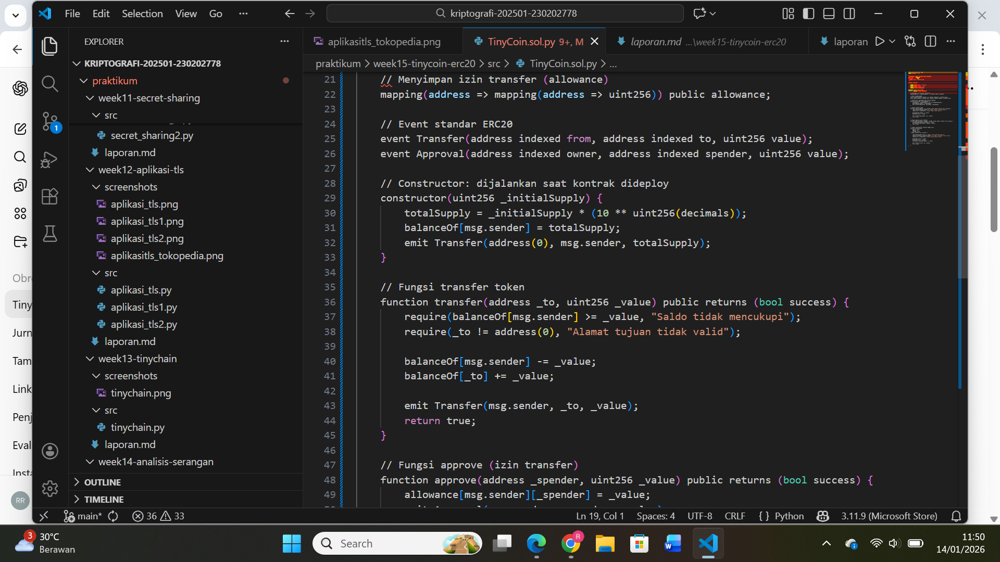

# Laporan Praktikum Kriptografi
Minggu ke-: 15
Topik:  Implementasi tinyCoin Smart Contract ERC20
Nama: Ratna Rizka Maharani
NIM: 230202778 
Kelas: 5IKRA

---

## 1. Tujuan
Tujuan dari praktikum ini adalah untuk memahami konsep dasar pembuatan dan implementasi smart contract ERC20 pada jaringan blockchain Ethereum. Melalui praktikum ini, mahasiswa diharapkan mampu mengenal standar ERC20 sebagai dasar pembuatan token digital, termasuk fungsi-fungsi utama seperti transfer token, pengecekan saldo, serta mekanisme persetujuan (approval) dalam transaksi token.

Selain itu, praktikum ini bertujuan untuk memberikan pengalaman praktis dalam proses pengembangan smart contract menggunakan bahasa pemrograman Solidity dan pemanfaatan library Oppenzeppelin. Dengan melakukan implementasi TinyCoin ERC20, mahasiswa dapat memahami bagaimana konsep kriptografi dan blockchain diterapkan secara nyata dalam sistem terdesentralisasi serta meningkatkan pemahaman terhadap keamanan dan transparansi transaksi digital.
---

## 2. Dasar Teori
Blockchain merupakan teknologi pencatatan data terdistribusi yang bersifat transparan, aman, dan tidak dapat diubah (immutable). Setiap transaksi yang terjadi akan divalidasi oleh jaringan dan disimpan dalam blok yang saling terhubung menggunakan mekanisme kriptografi. Teknologi ini menjadi fondasi utama dalam pengembangan aplikasi terdesentralisasi (decentralized applications / dApps) dan smart contract.

Smart contract adalah program yang berjalan di atas blockchain dan dieksekusi secara otomatis ketika kondisi tertentu terpenuhi. Pada jaringan Ethereum, smart contract ditulis menggunakan bahasa Solidity. Smart contract memungkinkan pembuatan sistem yang tidak bergantung pada pihak ketiga, sehingga meningkatkan kepercayaan dan efisiensi dalam transaksi digital. Namun, karena sifatnya yang tidak dapat diubah setelah dideploy, keamanan dan ketepatan logika kode menjadi hal yang sangat penting.

ERC20 adalah standar teknis yang digunakan untuk pembuatan token fungible pada blockchain Ethereum. Standar ini mendefinisikan sekumpulan fungsi dan event seperti transfer, balanceof, approve, dan transferFrom agar token dapat berinteraksi dengan dompet digital, exchange, dan aplikasi blockchain lainnya secara konsisten. Dengan adanya ERC20, pengembang dapat menciptakan token dengan tingkat interoperabilitas yang tinggi serta meminimalkan kesalahan implementasi melalui penggunaan library tepercaya seperti Openzeppelin.

---

## 3. Alat dan Bahan
(- Python 3.12.10
- Visual Studio Code / editor lain  
- Git dan akun GitHub  
- Library tambahan (misalnya pycryptodome, jika diperlukan)  )

---

## 4. Langkah Percobaan
(Tuliskan langkah yang dilakukan sesuai instruksi.  
Contoh format:
1. Membuat file `TinyCoin.py` di folder `praktikum/week15-tinycoin-erc20/src/`.
2. Menyalin kode program dari panduan praktikum.
3. Menjalankan program dengan perintah `python TinyCoin.py`.)

---

## 5. Source Code
(Salin kode program utama yang dibuat atau dimodifikasi.  
Gunakan blok kode:

```python
# contoh potongan kode
def encrypt(text, key):
    return ...
    Menyimpan izin transfer (allowance)
    mapping(address => mapping(address => uint256)) public allowance;

    // Event standar ERC20
    event Transfer(address indexed from, address indexed to, uint256 value);
    event Approval(address indexed owner, address indexed spender, uint256 value);

    // Constructor: dijalankan saat kontrak dideploy
    constructor(uint256 _initialSupply) {
        totalSupply = _initialSupply * (10 ** uint256(decimals));
        balanceOf[msg.sender] = totalSupply;
        emit Transfer(address(0), msg.sender, totalSupply);
    }

    // Fungsi transfer token
    function transfer(address _to, uint256 _value) public returns (bool success) {
        require(balanceOf[msg.sender] >= _value, "Saldo tidak mencukupi");
        require(_to != address(0), "Alamat tujuan tidak valid");

        balanceOf[msg.sender] -= _value;
        balanceOf[_to] += _value;

        emit Transfer(msg.sender, _to, _value);
        return true;
    }

    // Fungsi approve (izin transfer)
    function approve(address _spender, uint256 _value) public returns (bool success) {
        allowance[msg.sender][_spender] = _value;
        emit Approval(msg.sender, _spender, _value);
        return true;
    }

    // Fungsi transferFrom (transfer dengan izin)
    function transferFrom(
        address _from,
        address _to,
        uint256 _value
    ) public returns (bool success) {

        require(balanceOf[_from] >= _value, "Saldo tidak mencukupi");
        require(allowance[_from][msg.sender] >= _value, "Allowance tidak cukup");
        require(_to != address(0), "Alamat tujuan tidak valid");

        balanceOf[_from] -= _value;
        balanceOf[_to] += _value;
        allowance[_from][msg.sender] -= _value;

        emit Transfer(_from, _to, _value);
        return true;
    }


```
)

---

## 6. Hasil dan Pembahasan
(- Lampirkan screenshot hasil eksekusi program (taruh di folder `screenshots/`).  
- Berikan tabel atau ringkasan hasil uji jika diperlukan.  
- Jelaskan apakah hasil sesuai ekspektasi.  
- Bahas error (jika ada) dan solusinya. 

Hasil eksekusi program Caesar Cipher:




)

---

## 7. Jawaban Pertanyaan 
- Pertanyaan 1: Apa fungsi utama ERC20 dalam ekosistem blockchain?  
Jawab: Fungsi utama ERC20 dalam ekosistem blockchain yaitu sebagai standar teknis yang mengatur bagaimana sebuah token dibuat, dikelola, dan ditransaksikan di jaringan Ethereum. Dengan adanya standar ERC20, token dapat digunakan secara konsisten oleh berbagai aplikasi, dompet digital, dan platform pertukaran tanpa perlu penyesuaian khusus, sehingga meningkatkan interoperabilitas, kemudahan integrasi, serta kepercayaan dalam pengembangan dan penggunaan aset digital.


- Pertanyaan 2: Bagaimana mekanisme transfer token bekerja dalam kontrak ERC20? 
Jawab: Jadi menurut saya mekanisme transfer token dalam kontrak ERC20 bekerja melalui fungsi transfer yang memungkinkan pemilik token mengirim sejumlah token ke alamat lain, jadi ketika fungsi ini dipanggil, kontrak akan terlebih dahulu memeriksa apakah saldo pengirim mencukupi untuk melakukan transaksi dan jika saldo mencukupi, maka jumlah token yang dikirim akan dikurangi dari saldo pengirim dan ditambahkan ke saldo penerima, kemudian transaksi tersebut dicatat secara permanen di dalam blockchain. Proses ini memastikan bahwa perpindahan token dilakukan secara aman dan transparan tanpa memerlukan pihak ketiga.

Selain itu, standar ERC20 juga menyediakan fungsi transferFrom yang memungkinkan pihak ketiga melakukan transfer token atas nama pemilik, biasanya setelah mendapatkan izin melalui fungsi approve. Mekanisme ini banyak digunakan dalam aplikasi terdesentralisasi seperti decentralized exchange (DEX) dan smart contract lainnya. Setiap transfer akan memicu event Transfer yang dapat dipantau oleh aplikasi atau pengguna, sehingga seluruh aktivitas transaksi dapat diaudit dan diverifikasi secara publik di jaringan blockchain.


- Pertanyaan 3: Apa risiko utama dalam implementasi smart contract dan bagaimana cara mitigasinya? 
Jawab: Risiko utama dalam implementasi smart contract meliputi adanya bug atau kesalahan logika pada kode, celah keamanan seperti reentrancy attack, serta kesalahan pengelolaan hak akses yang dapat dimanfaatkan oleh pihak tidak bertanggung jawab. Risiko ini dapat diminimalkan dengan menerapkan praktik pengembangan yang baik, seperti menggunakan library tepercaya (misalnya OpenZeppelin), melakukan audit kode secara menyeluruh, menulis pengujian (testing) sebelum deployment, serta menggunakan versi compiler terbaru yang sudah dilengkapi perlindungan terhadap kesalahan umum.


---

## 8. Kesimpulan
menuryut saya kesimpulannya yaitu implementasi smart contract ERC20 pada proyek TinyCoin menunjukkan bahwa pembuatan token digital dapat dilakukan secara efisien dan aman dengan memanfaatkan standar yang telah tersedia, sehingga melalui penggunaan Solidity dan library OpenZeppelin, proses pengembangan menjadi lebih terstruktur serta meminimalkan risiko kesalahan keamanan. Praktikum ini memberikan pemahaman nyata mengenai cara kerja blockchain dan penerapan smart contract dalam sistem terdesentralisasi.


---

## 9. Daftar Pustaka  
Contoh:  
- Katz, J., & Lindell, Y. *Introduction to Modern Cryptography*.  
- Stallings, W. *Cryptography and Network Security*.  
- Antonopoulos, A. M. Mastering Ethereum. O’Reilly Media.
- Stallings, W. Cryptography and Network Security. Pearson Education.
- Trappe, W., & Washington, L. C. (2006). Introduction to Cryptography with Coding Theory (2nd ed.). Pearson.
- Singh, S. (1999). The Code Book: The Science of Secrecy from Ancient Egypt to Quantum Cryptography. Anchor Books
- Menezes, A. J., van Oorschot, P. C., & Vanstone, S. A. (1996). Handbook of Applied Cryptography. CRC Press.


## 10. Commit Log
(Tuliskan bukti commit Git yang relevan.  
Contoh:
```
commit a7f9c2e
Author: Ratna Rizka Maharani <ratnarizka033@gmail.com>
Date:   Friday 02 january 2026

    week15-tinycoin-erc20: Implementasi tinyCoin Smart Contract ERC20 dan laporan akhir )
```
