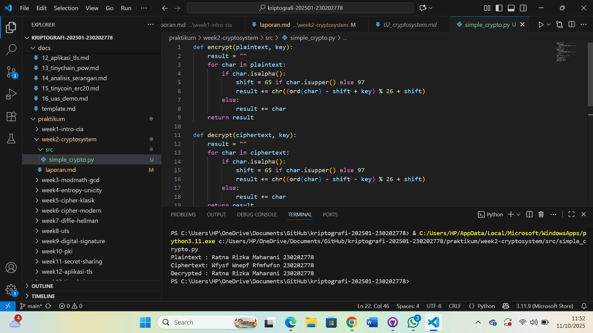

# Laporan Praktikum Kriptografi
Minggu ke-: 2
Topik: Cryptosystem 
Nama: Ratna Rizka Maharani
NIM: 230202778
Kelas: 5IKRB

---

## 1. Tujuan
- Mengidentifikasi mengenai komponen dasar kriptosistem (plainttext, ciphertext, kunci, algoritma)
- Menggambarkan tentang proses enkripsi dan deskripsi sederhana
- Mengklasifikasi jenis kriptosistem (simetris dan asimetris)

---

## 2. Dasar Teori
Jadi Kriptografi merupakan ilmu yang mempelajari teknik menjaga kerahasiaan, keaslian, dan integritas data dengan cara mengubah pesan asli (plaintext) menjadi bentuk tidak terbaca yaoitu(ciphertext). Proses ini disebut enkripsi, sedangkan proses mengembalikan ciphertext ke bentuk semula disebut dekripsi.

Sebuah kriptosistem terdiri dari beberapa komponen utama, yakni plaintext, ciphertext dan enkripsi/dekripsi, dan kunci (key). Algoritma adalah aturan/rumus yang digunakan untuk melakukan transformasi, sedangkan kunci menjadi parameter rahasia yang menentukan hasil dari enkripsi.

Sehingga umumnya terdapat dua jenis sistem kriptografi, yaitu kriptografi simetris dan kriptografi asimetris bedanya yaitu Kriptografi simetris menggunakan satu kunci yang sama untuk enkripsi dan dekripsi, misalnya Caesar Cipher, DES, dan AES. Sedangkan kriptografi asimetris menggunakan dua kunci berbeda, yaitu public key untuk enkripsi dan private key untuk dekripsi, misalnya RSA dan ECC.

---

## 3. Alat dan Bahan
(- Python 3.12.10 
- Visual Studio Code / editor lain  
- Git dan akun GitHub  
- Library tambahan (misalnya pycryptodome, jika diperlukan)  )

---

## 4. Langkah Percobaan
(Tuliskan langkah yang dilakukan sesuai instruksi.  
Contoh format:
1. Membuat file `simple_crypto.py` di folder `praktikum/week2-cryptosystem/src/`.
2. Menyalin kode program dari panduan praktikum.
3. Menjalankan program dengan perintah `python simple_crypto.py`.)

---

## 5. Source Code
(Salin kode program utama yang dibuat atau dimodifikasi.  
Gunakan blok kode:

```python
# contoh potongan kode
def encrypt(plaintext, key):
    result = ""
    for char in plaintext:
        if char.isalpha():
            shift = 65 if char.isupper() else 97
            result += chr((ord(char) - shift + key) % 26 + shift)
        else:
            result += char
    return result

def decrypt(ciphertext, key):
    result = ""
    for char in ciphertext:
        if char.isalpha():
            shift = 65 if char.isupper() else 97
            result += chr((ord(char) - shift - key) % 26 + shift)
        else:
            result += char
    return result

if __name__ == "__main__":
    message = "<nim><nama>"
    key = 5

    enc = encrypt(message, key)
    dec = decrypt(enc, key)

    print("Plaintext :", message)
    print("Ciphertext:", enc)
    print("Decrypted :", dec)
```
)

---

## 6. Hasil dan Pembahasan
(- Lampirkan screenshot hasil eksekusi program (taruh di folder `screenshots/`).  
- Berikan tabel atau ringkasan hasil uji jika diperlukan.  
- Jelaskan apakah hasil sesuai ekspektasi.  
- Bahas error (jika ada) dan solusinya. 

Hasil eksekusi program Caesar Cipher:




)

---

## 7. Jawaban Pertanyaan
1. Sebutkan komponen utama dalam sebuah kriptosistem. 
jawab: BERIKUT KOMPONEN UTAMA DALAM SEBUAH KRIPTOSISTEM:
       a. Plaintext yaitu pesan asli yang ingin dikirim.
       b. Ciphertext adalah pesan yang sudah dienkripsi (hasil penyandian).
       c. Algoritma enkripsi yaitu proses atau aturan untuk mengubah plaintext menjadi ciphertext.
       d. Algoritma dekripsi adalah proses untuk mengubah ciphertext kembali menjadi plaintext.
       e. Kunci (key) yaitu nilai rahasia yang digunakan dalam proses enkripsi dan dekripsi.

2. Apa kelebihan dan kelemahan sistem simetris dibandingkan asimetris?
jawab: Sistem kriptografi simetris memiliki kelebihan utama yaitu dalam hal kecepatan dan efisiensi, Karena hanya menggunakan satu kunci untuk proses enkripsi dan dekripsi, algoritma simetris dapat memproses data dengan lebih cepat dibandingkan sistem asimetris sehingga cocok digunakan untuk mengenkripsi data dalam jumlah besar, seperti file atau komunikasi real-time. Selain itu, implementasinya relatif sederhana serta membutuhkan sumber daya komputasi yang lebih rendah. Sedangkan 

Sistem simetris memiliki kelemahan yang cukup signifikan dibandingkan sistem asimetris. Masalahnya terletak pada distribusi kunci karena kunci yang sama digunakan oleh pengirim dan penerima, maka kunci tersebut harus dikirim melalui saluran yang aman. Jika kunci ini jatuh ke tangan pihak yang tidak berwenang, seluruh keamanan sistem dapat terancam. 
Berbeda dengan sistem asimetris yang menggunakan pasangan kunci publik dan privat, sistem simetris tidak memiliki mekanisme alami untuk mengamankan pertukaran kunci, sehingga rentan terhadap serangan penyadapan selama proses distribusi kunci.

3. Mengapa distribusi kunci menjadi masalah utama dalam kriptografi simetris?  
jawab: Iya karena distribusi kunci menjadi masalah utama dalam kriptografi simetris sebab menggunakan satu kunci yang sama untuk proses enkripsi dan dekripsi. Artinya, pengirim dan penerima pesan harus memiliki kunci yang identik sebelum komunikasi dimulai. Jika kunci tersebut dikirim melalui jaringan yang tidak aman, maka ada risiko pihak ketiga yanyg dapat mencuri kunci tersebut dan membaca seluruh isi pesan yang terenkripsi.


## 8. Kesimpulan

Dari hasil praktikum yang telah dilakukan, dapat disimpulkan bahwa proses enkripsi dan dekripsi adalah inti dari sistem kriptografi jadi Enkripsi berfungsi untuk mengubah plaintext menjadi ciphertext agar pesan tidak dapat dibaca oleh pihak yang tidak berwenang, sedangkan dekripsi untuk mengembalikan ciphertext menjadi plaintext semula dengan bantuan kunci yang sesuai. Melalui percobaan ini, dipahami bahwa keamanan data sangat bergantung pada algoritma dan kunci yang digunakan dalam proses dalam kriptografi.

## 9. Daftar Pustaka 
- Katz, J., & Lindell, Y. *Introduction to Modern Cryptography*.  
- Stallings, W. *Cryptography and Network Security*.  )
-

## 10. Commit Log

commit abc12345
Author: Ratna Rizka Maharani <ratnarizka033@gmail.com>
Date:   11-10-2025

    week2-cryptosystem: implementasi Caesar Cipher dan laporan )
```
