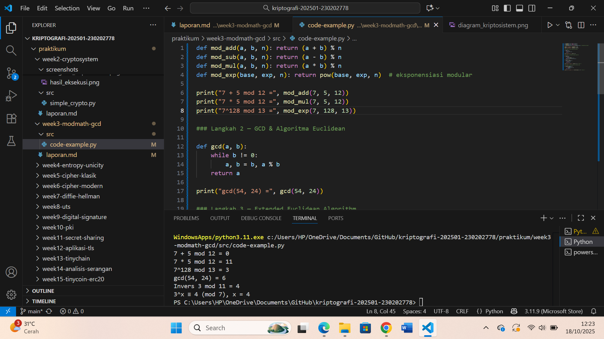

# Laporan Praktikum Kriptografi
Minggu ke-: 3
Topik: Modular math(Aritmetika Modular,GCD, Bilangan Prima, Logaritma Diskrit) 
Nama: Ratna Rizka Maharani
NIM: 230202778
Kelas: 5IKRB

---

## 1. Tujuan
1. Menyelesaikan operasi aritmetika modular.
2. Menentukan bilangan prima dan menghitung GCD (Greatest Comon Divisor)
3. Menerapkan logaritma diskrit sederhana dan simulasi kriptografi
---

## 2. Dasar Teori
Konsep modular aritmetika menjadi dasar penting dalam kriptografi klasik maupun modern sehingga Modular aritmetika adalah sistem operasi pada bilangan yang hasilnya dibatasi oleh modulus tertentu. operasi dasar seperti penjumlahan, pengurangan, pada operasi bilangan dengan sistem sisa (modulus), misalnya perhitungan “mod n” yang akan menghasilkan sisa pembagian dari suatu bilangan terhadap n. Dalam kriptografi, konsep ini digunakan untuk mengatur pergeseran huruf dalam alfabet, seperti pada Caesar Cipher, konsep ini menjadi pondasi utama dalam sustem kriptografi modern, terutama pada algoritma seperti RSA dan Diffle-Helman. dimana pergeseran huruf dilakukan berdasarkan nilai tertentu menggunakan operasi mod 26 (karena terdapat 26 huruf dalam alfabet Latin).

Cipher klasik merupakan sistem kriptografi yang digunakan pada masa awal perkembangan ilmu kriptografi, sebelum munculnya komputer modern. Cipher ini bekerja dengan cara mengubah susunan huruf dengan simbol tertentu berdasarkan aturan tertentu yang mudah dilakukan secara manual. Contoh cipher yaitu Caesar Cipher dan Vigenère Cipher, Transposition Cipher.

Algoritma Euchliden digunakan untuk mencari GCD 
Logaritma diskrit merupakan 

Secara keseluruhan, cipher klasik dan konsep modular aritmetika saling berkaitan dalam membentuk dasar dari berbagai teknik enkripsi awal. Walaupun cipher klasik kini dianggap kurang aman karena dapat dengan mudah dipecahkan menggunakan analisis frekuensi atau komputer, prinsip-prinsip matematis seperti modular aritmetika tetap menjadi fondasi penting dalam sistem kriptografi modern, termasuk pada algoritma kunci publik seperti RSA dan ElGamal.


---

## 3. Alat dan Bahan
(- Python 3.12.10
- Visual Studio Code / editor lain  
- Git dan akun GitHub  
- Library tambahan (misalnya pycryptodome, jika diperlukan)  )

---

## 4. Langkah Percobaan
(Tuliskan langkah yang dilakukan sesuai instruksi.  
Contoh format:
1. Membuat file `modular_math.py` di folder `praktikum/week3-modmath-gcd/src/`.
2. Menyalin kode program dari panduan praktikum.
3. Menjalankan program dengan perintah `python modular_math.py`.)

---

## 5. Source Code
(Salin kode program utama yang dibuat atau dimodifikasi.  
Gunakan blok kode:

```python
def mod_add(a, b, n): return (a + b) % n
def mod_sub(a, b, n): return (a - b) % n
def mod_mul(a, b, n): return (a * b) % n
def mod_exp(base, exp, n): return pow(base, exp, n)  # eksponensiasi modular

print("7 + 5 mod 12 =", mod_add(7, 5, 12))
print("7 * 5 mod 12 =", mod_mul(7, 5, 12))
print("7^128 mod 13 =", mod_exp(7, 128, 13))
```

### Langkah 2 — GCD & Algoritma Euclidean
Implementasikan fungsi GCD dengan algoritma Euclidean.  
```python
def gcd(a, b):
    while b != 0:
        a, b = b, a % b
    return a

print("gcd(54, 24) =", gcd(54, 24))
```

### Langkah 3 — Extended Euclidean Algorithm
Tambahkan fungsi untuk mencari invers modular.  
```python
def egcd(a, b):
    if a == 0:
        return b, 0, 1
    g, x1, y1 = egcd(b % a, a)
    return g, y1 - (b // a) * x1, x1

def modinv(a, n):
    g, x, _ = egcd(a, n)
    if g != 1:
        return None
    return x % n

print("Invers 3 mod 11 =", modinv(3, 11))  # hasil: 4
```

### Langkah 4 — Logaritma Diskrit (Discrete Log)
Simulasikan logaritma diskrit sederhana: mencari `x` sehingga `a^x ≡ b (mod n)`.  
```python
def discrete_log(a, b, n):
    for x in range(n):
        if pow(a, x, n) == b:
            return x
    return None

print("3^x ≡ 4 (mod 7), x =", discrete_log(3, 4, 7))  # hasil: 4
```
)

---

## 6. Hasil dan Pembahasan
(- Lampirkan screenshot hasil eksekusi program (taruh di folder `screenshots/`).  
- Berikan tabel atau ringkasan hasil uji jika diperlukan.  
- Jelaskan apakah hasil sesuai ekspektasi.  
- Bahas error (jika ada) dan solusinya. 

Hasil eksekusi program Caesar Cipher:


)

---

## 7. Jawaban Pertanyaan
1. Apa peran aritmetika modular dalam kriptografi modern?  
Jawab: Aritmetika modular berperan penting dalam kriptografi modern karena menjadi dasar proses enkripsi dan dekripsi data dan operasi ini menjaga hasil perhitungan tetap dalam batas bilangan tertentu dan memudahkan pengolahan bilangan besar. Dalam algoritma seperti RSA dan Diffie-Hellman, dan ECC untuk menjaga keamanan melalui operasi eksponensial modular aritmetika yang digunakan untuk membentuk fungsi satu arah yang sulit dibalik, sehingga menjaga keamanan dan kerahasiaan data.

2. Mengapa invers modular penting dalam algoritma kunci publik (misalnya RSA)?  
Jawab: Invers modular digunakan untuk menghitung kunci privat dari kunci publik dan penting dalam algoritma kunci publik seperti RSA karena digunakan untuk menghitung kunci privat (d) adalah invers modular dari kunci publik (e) terhadap n dan memungkinkan proses deskripsi pesan serta Invers modular memastikan bahwa hasil dekripsi dapat mengembalikan pesan asli dari hasil enkripsi. Tanpa invers modular, proses pembalikan dari ciphertext ke plaintext tidak dapat dilakukan, sehingga sistem enkripsi tidak akan berfungsi dengan benar.

3. Apa tantangan utama dalam menyelesaikan logaritma diskrit untuk modulus besar? 
Jawab:  Tantangan utama dalam menyelesaikan logaritma diskrit untuk modulus besar adalah tingginya tingkat kesulitan kompleksitas komputasi untuk modulus besar ratusan/ribuan bit mencari nilai x yang memenuhi = b mod(n) tidak mungkin dlakukan dengan cara brute force menjadi dasar keamanan algoritma kriptografi seperti Diffie-Hellman. Tidak ada algoritma efisien yang dapat menghitungnya dengan cepat, karena prosesnya memerlukan waktu eksponensial seiring bertambahnya ukuran modulus dan Kesulitan inilah yang menjadi dasar keamanan algoritma ElGamal

---

## 8. Kesimpulan
Dari Praktikum ini dapat disimpulkan bahwa aritmetika modular merupakan dasar penting dalam kriptografi modern.Algoritma Eucliden dan extended Euclidean memungkinkan perhitungan GCD serta invers modular secara efisien, sedangkan logaritma diskrit adalah konsep yang sulit dipecahkan dan menjadi dasar keamanan berbagai sistem enkripsi.
Aritmetika modular memungkinkan pengolahan bilangan besar dengan hasil yang tetap terkontrol. Konsep ini menjaga keamanan sistem enkripsi modern melalui operasi matematika yang sulit dibalik tanpa kunci rahasia.

---

## 9. Daftar Pustaka
(Cantumkan referensi yang digunakan.  
Contoh:  
- Katz, J., & Lindell, Y. *Introduction to Modern Cryptography*.  
- Stallings, W. *Cryptography and Network Security*.  )
-
---

## 10. Commit Log
(Tuliskan bukti commit Git yang relevan.  
Contoh:
```
commit abc12345
Author: Ratna Rizka Maharani <ratnarizka033@gmail.com>
Date:   Sabtu 18 oktober 2025r

    week2-cryptosystem: implementasi Caesar Cipher dan laporan )
```
