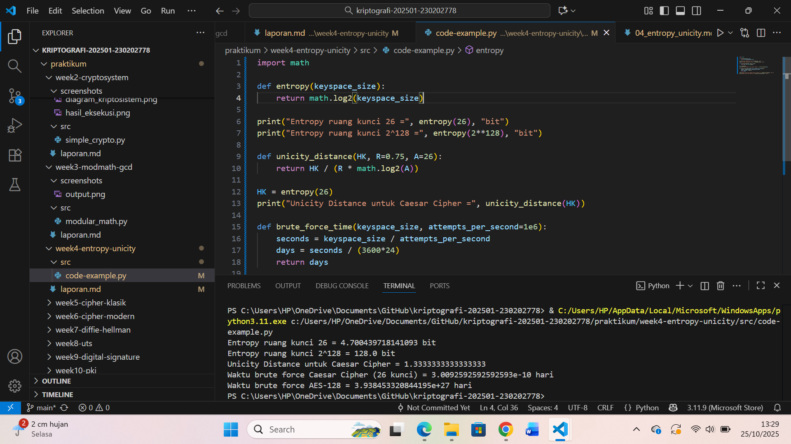

# Laporan Praktikum Kriptografi
Minggu ke-: 4
Topik: Entropy & Unicity Distance (Evaluasi Kekuatan Kunci dan Brute Force)
Nama: Ratna Rizka Maharani 
NIM: 230202778
Kelas: 5IKRB

---

## 1. Tujuan
1. Menyelesaikan perhitungan sederhana terkait entropi kunci
2. yaitu Menggunakan teorema euler pada contoh perhitungan modular & invers
3. Menghitung jarak kesatuan untuk chipertext tertentu
4. Menganalisis kekuatan kunci berdasarkan entropi dan jarak kesatuan 
5. Mengevaluasi potensi serangan brute force pada kriptosistem sederhana


---

## 2. Dasar Teori
a. Di dalam konteks kriptografi entropy yaitu tingkat keacakan dari sebuah kunci. yang menggambarkan semakin besar nilai entropi, semakin sulit kunci tersebut ditebak, karena ruang kuncinya lebih luas sehingga entropi dihitung menggunakan rumus H (𝐾) = log₂ |𝐾|, di mana ∣𝐾∣ adalah ukuran ruang kunci. sehingga Entropi (Shannon entropy)mengukur tingkat keacakan atau ketidakpastian suatu sistem kunci.
Rumus:[H = -\sum p_i \log_2 p_i]
Untuk kunci acak dari (N) kemungkinan, entropi kunci (H = \log_2 N) bit.
Semakin besar entropi → semakin sulit ditebak (lebih aman dari brute force).

Contoh perhitungan entropi
Caesar cipher: (N=26 \Rightarrow H \approx 4{,}7) bit → sangat lemah.
Vigenère (kunci 5 huruf): (H \approx 23{,}5) bit → masih mudah dipecahkan.
AES-128: (H = 128) bit → sangat kuat.

b.Teorema Euler & Invers Modular Jika (\gcd(a,n)=1), maka:[a^{\varphi(n)} \equiv 1 \pmod n\Rightarrow a^{-1} \equiv a^{\varphi(n)-1} \pmod n]
Untuk mencari invers, digunakan algoritma Euclid diperpanjang contoh Cari invers (17^{-1} \bmod 3120) dan Hasilnya (d = 2753), karena (17 \times 2753 \equiv 1 \pmod{3120}).
Jarak Kesatuan (Hamming Distance)Mengukur jumlah bit berbeda antara dua ciphertext.
Contoh:c1 = 1101001 c2 = 1001101 Perbedaan di posisi 2 dan 5 → jarak = 2 bit.
Cipher kuat jika perubahan kecil pada kunci/plaintext mengubah ~50% bit ciphertext.

c.Kekuatan Kunci Berdasarkan Entropi & Jarak
Entropi tinggi → ruang kunci besar → sulit brute force.
Jarak Hamming besar → difusi baik → sulit dianalisis.Kombinasi keduanya = cipher kuat.
Caesar: lemah
Vigenère: sedang
AES-128: sangat kuat

d. Evaluasi Serangan Brute Force
Rata-rata waktu pencarian kunci ≈ (2^{H-1}/R) detik
(dengan (R) = tebakan per detik).Contoh:
Caesar: ≈ 0.000013 s → sangat mudah.
Vigenère (5 huruf): ≈ 6 s → masih bisa dipecahkan.
AES-128: ≈ (5.4 \times 10^{18}) tahun → mustahil di-brute force.

e. dalam Unicity distance yaitu ukuran panjang ciphertext minimum yang dibutuhkan agar dapat secara unik menentukan kunci yang digunakan. Rumusnya 𝑈 = 𝐻(𝐾)/ 𝑅⋅log_2 ∣𝐴∣, dengan 𝑅 sebagai redundansi bahasa dan ∣𝐴∣ jumlah alfabet. Semakin besar nilai U, semakin aman cipher terhadap analisis serangan frekuensi.sedangkan dalam serangan brute force adalah metode penyerangan dengan mencoba semua kemungkinan kunci sampai ditemukan yang benar. Meskipun sederhana, serangan ini masih menjadi ancaman nyata bila ukuran ruang kunci kecil atau sistem memiliki kelemahan implementasi.

f. jadi kesimpulan yang didapat adalah Entropi mengukur keamanan kunci dari invers modular dan teorema Euler digunakan dalam operasi kunci kriptografi sedangkan hamming distance menilai difusi dan kekuatan cipher. kemudian Kunci besar (≥128 bit) dengan difusi tinggi tahan terhadap brute force dan analisis pola.

---

3. Alat dan Bahan
(- Python 3.12.10
- Visual Studio Code / editor lain  
- Git dan akun GitHub  
- Library tambahan (mathpycryptodome, jika diperlukan)  )

---

4. Langkah Percobaan
(Tuliskan langkah yang dilakukan sesuai instruksi.  
Contoh format:
1. Membuat file `caesar_cipher.py` di folder `praktikum/week2-cryptosystem/src/`.
2. Menyalin kode program dari panduan praktikum.
3. Menjalankan program dengan perintah `python caesar_cipher.py`.)

---

## 5. Source Code
```python
import math

def entropy(keyspace_size):
    return math.log2(keyspace_size)

print("Entropy ruang kunci 26 =", entropy(26), "bit")
print("Entropy ruang kunci 2^128 =", entropy(2**128), "bit")

def unicity_distance(HK, R=0.75, A=26):
    return HK / (R * math.log2(A))

HK = entropy(26)
print("Unicity Distance untuk Caesar Cipher =", unicity_distance(HK))

def brute_force_time(keyspace_size, attempts_per_second=1e6):
    seconds = keyspace_size / attempts_per_second
    days = seconds / (3600*24)
    return days

print("Waktu brute force Caesar Cipher (26 kunci) =", brute_force_time(26), "hari")
print("Waktu brute force AES-128 =", brute_force_time(2**128), "hari")
```

---

 6. Hasil dan Pembahasan
(- Lampirkan screenshot hasil eksekusi program (taruh di folder `screenshots/`).  
- Berikan tabel atau ringkasan hasil uji jika diperlukan.  
- Jelaskan apakah hasil sesuai ekspektasi.  
- Bahas error (jika ada) dan solusinya. 

Hasil eksekusi program Caesar Cipher:


)

---

 7. Jawaban Pertanyaan
1. Apa arti dari nilai entropydalam konteks kekuatan kunci?  
jawab: dalam nilai entropi menunjukkan tingkat keacakan dan ketidakpastian kunci.
Semakin tinggi nilai entropi, maka semakin besar ruang kemungkinan kunci yang harus ditebak oleh penyerang, sehingga semakin kuat serta sulit dipecahkan dengan brute force.

2. Mengapa unicity distance penting dalam menentukan keamanan suatu cipher? 
jawab: Alasannya karena unicity distance menunjukkan jumlah minimum ciphertext yang dibutuhkan agar kunci dapat ditentukan secara unik. Semakin besar nilai unicity distance, semakin sulit bagi penyerang untuk menemukan kunci yang benar dari ciphertext yang artinya cipher lebih aman untuk analisis kriptografi dan seberapa banyak ciphertext yang dibutuhkan agar penyerang dapat menemukan kunci dengan pasti. Nilai U yang besar menunjukkan cipher lebih tahan terhadap analisis frekuensi.

3. Mengapa brute force masih menjadi ancaman meskipun algoritma sudah kuat?  
jawab: alasannya yaitu Brute force tetap menjadi ancaman karena jika kunci lemah kelemahan ada di algoritma pada ukuran ruang kunci, panjang kunci kecil, atau sistem implementasi tidak aman (misalnya kunci mudah ditebak atau bocor) karena jika kunci terlalu pendek atau implementasi lemah, brute force tetap bisa berhasil dalam waktu yang wajar. 
maka penyerang masih dapat mencoba semua kemungkinan.Selain itu, peningkatan kecepatan komputasi dan penggunaan komputasi paralel membuat brute force semakin efisien dari waktu ke waktu.
---

## 8. Kesimpulan
dapat disimpulkan bahwa:
Entropi kunci berperan penting dalam mengukur tingkat keacakan dan kekuatan suatu sistem kriptografi. Semakin besar nilai entropi, semakin luas ruang kunci yang harus diuji oleh penyerang, sehingga sistem menjadi lebih aman dari serangan brute force.

Teorema Eulerperhitungan invers modular digunakan untuk menentukan kunci privat atau invers dalam algoritma kriptografi seperti RSA, yang memastikan proses enkripsi dan dekripsi berjalan dengan benar.

jarak kesatuan (Hamming distance) digunakan untuk menilai tingkat perubahan ciphertext akibat perubahan kecil pada plaintext atau kunci. Cipher yang baik memiliki jarak Hamming tinggi, menandakan difusi dan keamanan yang kuat.

Analisis kekuatan kunci menunjukkan bahwa cipher dengan entropi rendah (seperti Caesar dan Vigenère pendek) mudah dipecahkan, sedangkan algoritma modern seperti AES dengan entropi tinggi (≥128 bit) jauh lebih tahan terhadap serangan.

Evaluasi serangan brute force** membuktikan bahwa meskipun brute force merupakan metode universal, efektivitasnya sangat tergantung pada panjang kunci dan tingkat entropi. Semakin besar nilai entropi, semakin tidak praktis brute force dilakukan.

Secara keseluruhan, keamanan kriptosistem sederhana sangat bergantung pada entropi kunci, kekuatan difusi (jarak kesatuan), serta penerapan konsep matematika seperti teorema Euler dan invers modular untuk menjaga kerahasiaan dan integritas data. Dari percobaan ini dapat disimpulkan bahwa semakin besar ruang kunci, semakin tinggi nilai entropinya dan semakin aman sistem kriptografinya. Nilai unicity distance juga berperan penting dalam menentukan ketahanan cipher terhadap analisis. Brute force dapat diabaikan untuk algoritma modern seperti AES-128 karena waktu yang dibutuhkan sangat tidak realistis, dan dari percobaan ini dapat disimpulkan bahwa semakin besar ruang kunci, semakin tinggi nilai entropinya dan semakin aman sistem kriptografinya. Nilai unicity distance juga berperan penting dalam menentukan ketahanan cipher terhadap analisis. Brute force dapat diabaikan untuk algoritma modern seperti AES-128 karena waktu yang dibutuhkan sangat tidak realistis.


---

## 9. Daftar Pustaka
(Cantumkan referensi yang digunakan.  
Contoh:  
- Katz, J., & Lindell, Y. *Introduction to Modern Cryptography*.  
- Stallings, W. *Cryptography and Network Security*.  )
-Paar, C., & Pelzl, J. (2010). Understanding Cryptography: A Textbook for Students and Practitioners. Springer.
- Trappe, W., & Washington, L. C. (2006). Introduction to Cryptography with Coding Theory (2nd ed.). Pearson.
- Singh, S. (1999). The Code Book: The Science of Secrecy from Ancient Egypt to Quantum Cryptography. Anchor Books
-Menezes, A. J., van Oorschot, P. C., & Vanstone, S. A. (1996). Handbook of Applied Cryptography. CRC Press.
- Singh, S. (1999). The Code Book: The Science of Secrecy from Ancient Egypt to Quantum Cryptography. Anchor Books.
---

## 10. Commit Log
(Tuliskan bukti commit Git yang relevan.  
Contoh:
```
commit abc12345
Author: Ratna Rizka Maharani <230202778>
Date:   2025-10-25 sabtu

  week4-entropy-unicity  : implementasi Caesar Cipher dan laporan )
```
