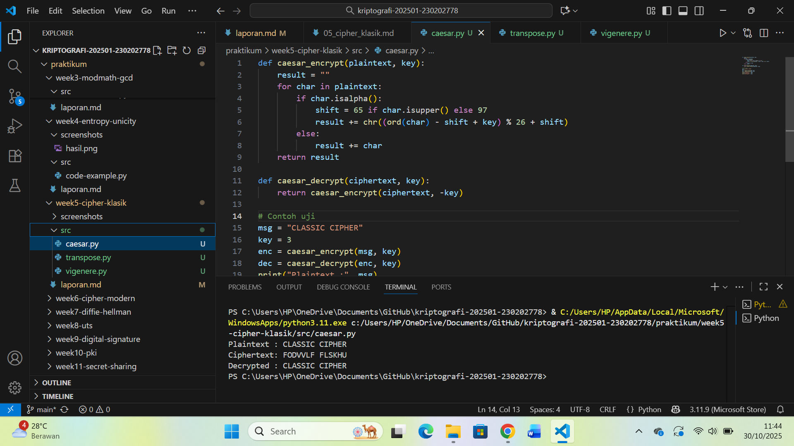
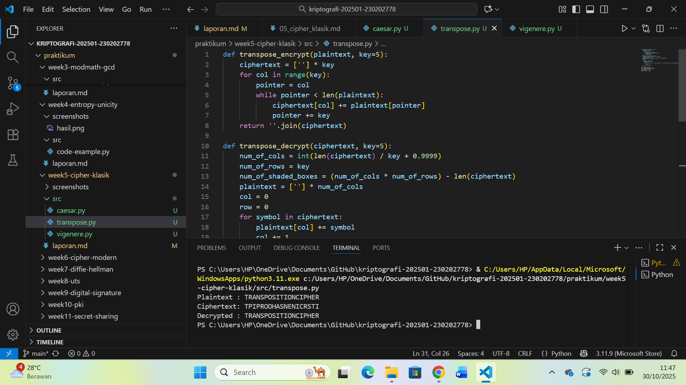
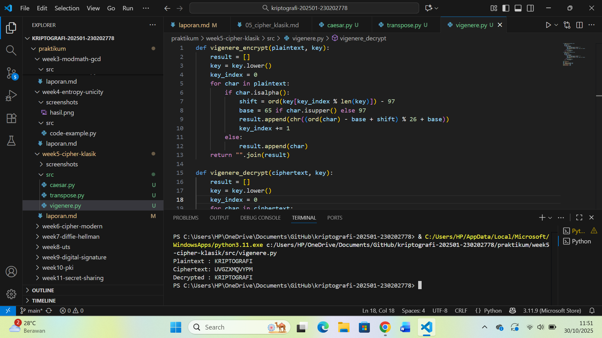

# Laporan Praktikum Kriptografi
Minggu ke-: X  
Topik: Cipher Klasik (Caesar, Vigenère, Transposisi)
Nama: Ratna Rizka Maharani
NIM: 230202778 
Kelas: 5IKRB

---

## 1. Tujuan
1. Menerapkan algoritma **Caesar Cipher** untuk enkripsi dan dekripsi teks.  
2. Menerapkan algoritma **Vigenère Cipher** dengan variasi kunci.  
3. Mengimplementasikan algoritma transposisi sederhana.  
4. Menjelaskan kelemahan algoritma kriptografi klasik.  


---

## 2. Dasar Teori
Cipher klasik merupakan teknik penyandian pesan sederhana yang digunakan sebelum munculnya kriptografi modern. Tujuan utamanya adalah menyamarkan isi pesan agar tidak dapat dibaca oleh pihak yang tidak berwenang. Dua kategori utama dalam cipher klasik adalah substitusi (mengganti huruf dengan huruf lain) dan transposisi (mengubah urutan huruf tanpa mengubah identitasnya).

Pada Caesar Cipher, setiap huruf dalam teks digeser sejauh nilai kunci tertentu dalam alfabet menggunakan operasi modular aritmetika (mod 26). Sementara itu, Vigenère Cipher menggunakan serangkaian pergeseran berdasarkan karakter kunci, sehingga lebih kompleks dibanding Caesar. Di sisi lain, cipher transposisi tidak mengubah huruf yang digunakan, tetapi mengacak urutannya berdasarkan pola tertentu (misalnya jumlah kolom pada tabel).

Secara umum, cipher klasik mudah diimplementasikan dan efektif untuk pembelajaran dasar kriptografi, namun lemah terhadap analisis frekuensi dan serangan brute force karena dengan ruang kuncinya kecil dan pola huruf tetap mudah dikenali.

---

## 3. Alat dan Bahan
(- Python 3.12.10 
- Visual Studio Code / editor lain  
- Git dan akun GitHub  
- Library tambahan (misalnya pycryptodome, jika diperlukan)  )

---

## 4. Langkah Percobaan
Tuliskan langkah yang dilakukan sesuai instruksi.  
Contoh format:
1. Membuat file `caesar.py, vigenere.py, transpose.py` di folder `praktikum/week5-cipher-klasik/src/'.
2. Menyalin kode program dari panduan praktikum.
3. Menjalankan program dengan perintah `python caesar.py, vigenere.py, transpose.py`

---

## 5. Source Code
Salin kode program utama yang dibuat atau dimodifikasi.  
Gunakan blok kode:

```python
def caesar_encrypt(plaintext, key):
    result = ""
    for char in plaintext:
        if char.isalpha():
            shift = 65 if char.isupper() else 97
            result += chr((ord(char) - shift + key) % 26 + shift)
        else:
            result += char
    return result

def caesar_decrypt(ciphertext, key):
    return caesar_encrypt(ciphertext, -key)

# Contoh uji
msg = "CLASSIC CIPHER"
key = 3
enc = caesar_encrypt(msg, key)
dec = caesar_decrypt(enc, key)
print("Plaintext :", msg)
print("Ciphertext:", enc)
print("Decrypted :", dec)
```

---

### Langkah 2 — Implementasi Vigenère Cipher
```python
def vigenere_encrypt(plaintext, key):
    result = []
    key = key.lower()
    key_index = 0
    for char in plaintext:
        if char.isalpha():
            shift = ord(key[key_index % len(key)]) - 97
            base = 65 if char.isupper() else 97
            result.append(chr((ord(char) - base + shift) % 26 + base))
            key_index += 1
        else:
            result.append(char)
    return "".join(result)

def vigenere_decrypt(ciphertext, key):
    result = []
    key = key.lower()
    key_index = 0
    for char in ciphertext:
        if char.isalpha():
            shift = ord(key[key_index % len(key)]) - 97
            base = 65 if char.isupper() else 97
            result.append(chr((ord(char) - base - shift) % 26 + base))
            key_index += 1
        else:
            result.append(char)
    return "".join(result)

# Contoh uji
msg = "KRIPTOGRAFI"
key = "KEY"
enc = vigenere_encrypt(msg, key)
dec = vigenere_decrypt(enc, key)
print("Plaintext :", msg)
print("Ciphertext:", enc)
print("Decrypted :", dec)
```

---

### Langkah 3 — Implementasi Transposisi Sederhana
```python
def transpose_encrypt(plaintext, key=5):
    ciphertext = [''] * key
    for col in range(key):
        pointer = col
        while pointer < len(plaintext):
            ciphertext[col] += plaintext[pointer]
            pointer += key
    return ''.join(ciphertext)

def transpose_decrypt(ciphertext, key=5):
    num_of_cols = int(len(ciphertext) / key + 0.9999)
    num_of_rows = key
    num_of_shaded_boxes = (num_of_cols * num_of_rows) - len(ciphertext)
    plaintext = [''] * num_of_cols
    col = 0
    row = 0
    for symbol in ciphertext:
        plaintext[col] += symbol
        col += 1
        if (col == num_of_cols) or (col == num_of_cols - 1 and row >= num_of_rows - num_of_shaded_boxes):
            col = 0
            row += 1
    return ''.join(plaintext)

# Contoh uji
msg = "TRANSPOSITIONCIPHER"
enc = transpose_encrypt(msg, key=5)
dec = transpose_decrypt(enc, key=5)
print("Plaintext :", msg)
print("Ciphertext:", enc)
print("Decrypted :", dec)
```


---

## 6. Hasil dan Pembahasan
(- Lampirkan screenshot hasil eksekusi program (taruh di folder `screenshots/`).  
- Berikan tabel atau ringkasan hasil uji jika diperlukan.  
- Jelaskan apakah hasil sesuai ekspektasi.  
- Bahas error (jika ada) dan solusinya. 

Hasil eksekusi program Caesar Cipher:




)

---

## 7. Jawaban Pertanyaan
 1. Apa kelemahan utama algoritma Caesar Cipher dan Vigenère Cipher?
Jawab: kelemahan Caesar Cipher adalah ruang kuncinya sangat kecil (hanya 25 kemungkinan), sehingga mudah dipecahkan dengan brute force. Vigenère Cipher lebih kuat, tetapi tetap rentan terhadap analisis dengan frekuensi jika panjang kunci diketahui atau teksnya cukup panjang.

2. Mengapa cipher klasik mudah diserang dengan analisis frekuensi?
Jawab: Karena cipher klasik tidak mengubah pola statistik huruf dalam bahasa alami. Misalnya, huruf “E” yang sering muncul di teks bahasa Inggris juga akan sering muncul di ciphertext, hanya dalam bentuk huruf lain.

3. Bandingkan kelebihan dan kelemahan cipher substitusi vs transposisi.
Jawab: Cipher substitusi mengganti huruf dengan simbol atau huruf lain, sedangkan transposisi hanya mengubah posisi huruf. Substitusi mudah dipahami dan cepat dilakukan, tetapi pola frekuensi tetap terlihat. Transposisi menyembunyikan pola lebih baik, namun membutuhkan aturan kolom/baris yang tepat agar bisa didekripsi dengan benar.
---

## 8. Kesimpulan
Melalui praktikum ini, diperoleh pemahaman bahwa cipher klasik seperti Caesar, Vigenère, dan Transposisi merupakan dasar penting dalam kriptografi.
Ketiganya mudah diprogram dan menjelaskan konsep dasar enkripsi–dekripsi, namun tidak aman untuk penggunaan modern karena dapat dipecahkan dengan analisis sederhana.

---

## 9. Daftar Pustaka
- Katz, J., & Lindell, Y. *Introduction to Modern Cryptography*.  
- Stallings, W. *Cryptography and Network Security*.
 Paar, C., & Pelzl, J. (2010). Understanding Cryptography: A Textbook for Students and Practitioners. Springer.
- Trappe, W., & Washington, L. C. (2006). Introduction to Cryptography with Coding Theory (2nd ed.). Pearson.
- Singh, S. (1999). The Code Book: The Science of Secrecy from Ancient Egypt to Quantum Cryptography. Anchor Books
 Menezes, A. J., van Oorschot, P. C., & Vanstone, S. A. (1996). Handbook of Applied Cryptography. CRC Press.
---

## 10. Commit Log
```
commit abc12345
Author: Ratna Rizka Maharani <ratnarizka033@gmail.com>
Date:   Thu Oct 30 10:51:13 2025 +0700

    week5-cipher-klasik
```
