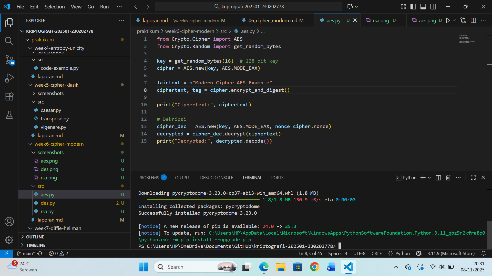
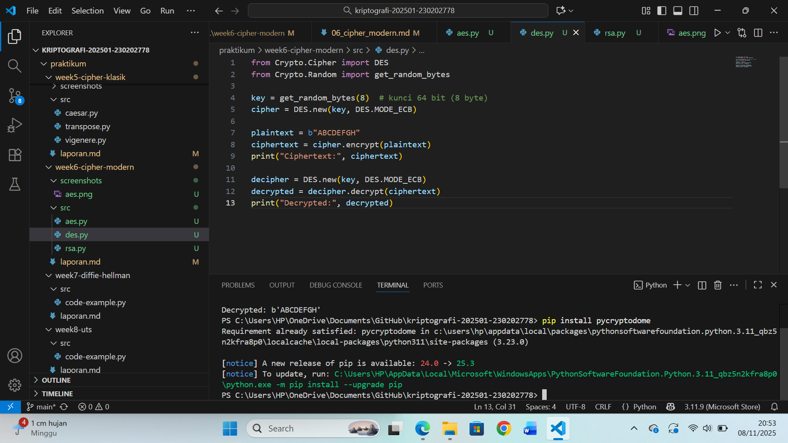
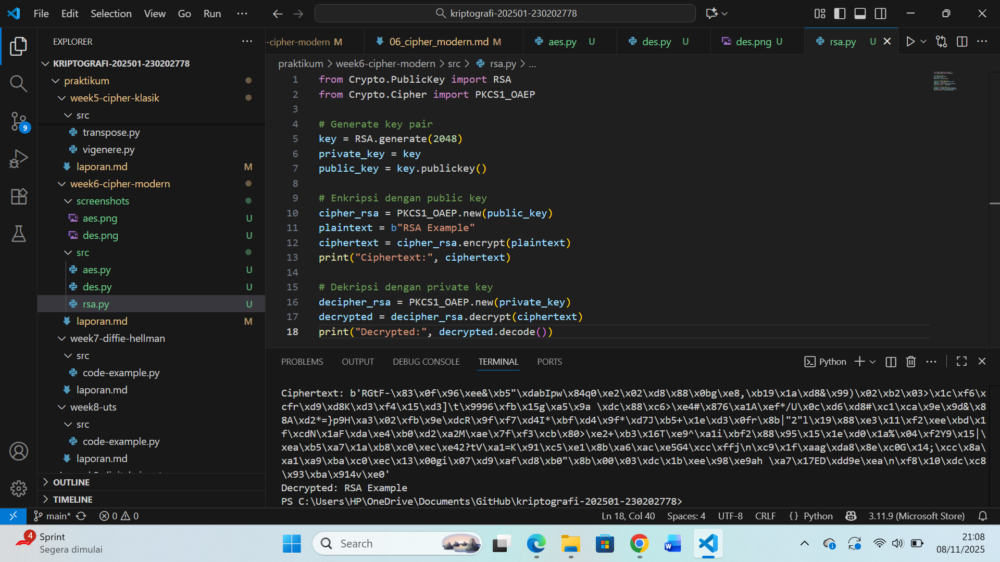

# Laporan Praktikum Kriptografi
Minggu ke-: 06
Topik: Cipher Modern  
Nama: RATNA RIZKA MAHARANI 
NIM: 230202778
Kelas: 5IKRB

---

## 1. Tujuan
Setelah mengikuti praktikum ini, mahasiswa diharapkan mampu:
1. Mengimplementasikan algoritma DES untuk blok data sederhana.
2. Menerapkan algoritma AES dengan panjang kunci 128 bit.
3. Menjelaskan proses pembangkitan kunci publik dan privat pada algoritma RSA.

---

## 2. Dasar Teori
Cipher modern adalah algoritma kriptografi yang digunakan untuk melindungi data digital dengan tingkat keamanan tinggi. Tidak seperti cipher klasik yang menggunakan substitusi dan transposisi sederhana, sehingga cipher modern bekerja dengan prinsip matematis kompleks dan menggunakan operasi bit pada blok data.

DES (Data Encryption Standard) merupakan algoritma blok simetris dengan panjang kunci 56 bit dan ukuran blok 64 bit. DES menggunakan operasi permutasi dan substitusi melalui 16 putaran Feistel Network. Meskipun pernah populer dan standar, kini DES dianggap kurang aman karena kekuatan komputasi modern dapat memecahkannya dengan brute force.

AES (Advanced Encryption Standard) merupakan pengganti DES standar modern sehingga AES ini menggunakan panjang kunci 128, 192, atau 256 bit panjangnya. AES bekerja pada blok 128 bit menggunakan operasi substitusi, pergeseran baris, dan pencampuran kolom. Keunggulan AES yaitu kecepatan tinggi dan tingkat keamanan kuat terhadap serangan kriptanalisis.

RSA (Rivest–Shamir–Adleman) adalah algoritma kunci publik (asimetris) yang menggunakan dua kunci yaitu kunci publik untuk enkripsi dan kunci privat untuk dekripsi. Keamanannya bergantung pada kesulitan faktorisasi bilangan prima dalam jumlh besar. RSA digunakan luas dalam komunikasi aman, tanda tangan digital, dan pertukaran kunci.
---

## 3. Alat dan Bahan
Python 3.12.10
- Visual Studio Code / editor lain
- Git dan akun GitHub  
- Library tambahan (misalnya pycryptodome, jika diperlukan)  

---

## 4. Langkah Percobaan
(Tuliskan langkah yang dilakukan sesuai instruksi.  
Contoh format:
1. Membuat file `aes.py,des.py, rsa.py` di folder `praktikum/week6-cipher-modern/src/`.
2. Menyalin kode program dari panduan praktikum.
3. Menjalankan program dengan perintah `python aes.py, python des.py, python rsa.py`.)

---

## 5. Source Code
Salin kode program utama yang dibuat atau dimodifikasi.  
Gunakan blok kode:
Kode sumber des.py
```python
from Crypto.Cipher import DES
from Crypto.Random import get_random_bytes

key = get_random_bytes(8)  # kunci 64 bit (8 byte)
cipher = DES.new(key, DES.MODE_ECB)

plaintext = b"ABCDEFGH"
ciphertext = cipher.encrypt(plaintext)
print("Ciphertext:", ciphertext)

decipher = DES.new(key, DES.MODE_ECB)
decrypted = decipher.decrypt(ciphertext)
print("Decrypted:", decrypted)
```

Kode sumber aes.py
```python
from Crypto.Cipher import AES
from Crypto.Random import get_random_bytes

key = get_random_bytes(16)  # 128 bit key
cipher = AES.new(key, AES.MODE_EAX)

plaintext = b"Modern Cipher AES Example"
ciphertext, tag = cipher.encrypt_and_digest(plaintext)

print("Ciphertext:", ciphertext)

# Dekripsi
cipher_dec = AES.new(key, AES.MODE_EAX, nonce=cipher.nonce)
decrypted = cipher_dec.decrypt(ciphertext)
print("Decrypted:", decrypted.decode())
```
---
Kode sumber rsa.py
### Langkah 3 — Implementasi RSA
```python
from Crypto.PublicKey import RSA
from Crypto.Cipher import PKCS1_OAEP

# Generate key pair
key = RSA.generate(2048)
private_key = key
public_key = key.publickey()

# Enkripsi dengan public key
cipher_rsa = PKCS1_OAEP.new(public_key)
plaintext = b"RSA Example"
ciphertext = cipher_rsa.encrypt(plaintext)
print("Ciphertext:", ciphertext)

# Dekripsi dengan private key
decipher_rsa = PKCS1_OAEP.new(private_key)
decrypted = decipher_rsa.decrypt(ciphertext)
print("Decrypted:", decrypted.decode())
```
---

---

6. Berikan tabel atau ringkasan hasil uji jika diperlukan.
- Menjelaskan apakah hasil sesuai ekspektasi.
- Bahas error (jika ada) dan solusinya.
- Hasil eksekusi program Caesar Cipher:





---

## 7. Jawaban Pertanyaan
Jawab pertanyaan diskusi yang diberikan pada modul.  
1. Apa perbedaan mendasar antara DES, AES, dan RSA dalam hal kunci dan keamanan?  
Jawab: DES dan AES merupakan algoritma simetris yang menggunakan satu kunci sama untuk enkripsi dan dekripsi, sedangkan RSA merupakan asimetris yang menggunakan dua kunci: publik dan privat. Dari segi keamanan, AES jauh lebih kuat dibanding DES karena panjang kunci yang lebih besar (128–256 bit) dan struktur matematis yang lebih kompleks. sedangkan RSA mengandalkan kompleksitas faktorisasi sejumlah besar.

2. Mengapa AES lebih banyak digunakan dibanding DES di era modern?  
Jawab: menurut saya karena AES memiliki kecepatan yang lebih tinggi efisiensi serta lebih baik untuk perangkat keras maupun lunak, dan tingkat keamanannya yang jauh lebih tinggi. DES memiliki panjang kunci pendek (56 bit) yang mudah diretas dengan serangan brute force. AES menggantikan DES karena lebih cepat, lebih efisien di perangkat keras dan lunak, serta memiliki tingkat keamanan tinggi.

3. Mengapa RSA dikategorikan sebagai algoritma asimetris, dan bagaimana proses pembangkitan kuncinya?   
Jawab:RSA dikategorikan asimetris karena menggunakan dua kunci berbeda yaitu kunci publik untuk enkripsi dan kunci privat untuk dekripsi. Proses pembangkitan kunci RSA melibatkan pemilihan dua bilangan prima besar (p dan q), menghitung modulus n = p × q, serta menentukan eksponen publik (e) dan menghitung eksponen privat (d) sebagai invers dari 𝑒 terhadap 𝜙(𝑛).berdasarkan fungsi Euler φ(n).
---

## 8. Kesimpulan
Jadi pada praktikum ini dapat disimpulkan bahwasanya algoritma diatas telah berhasil diimplementasikan algoritma cipher modern DES, AES, dan RSA menggunakan Python. selain itu AES terbukti lebih efisien dan aman dibanding DES, sedangkan RSA memberikan konsep keamanan berbasis kunci publik. Seluruh proses enkripsi dan dekripsi berjalan dengan hasil sesuai teori, algoritma DES, AES, dan RSA memiliki perbedaan pada jenis kunci dan tingkat keamanan. AES dan DES adalah cipher simetris, sedangkan RSA yaitu cipher asimetris. AES lebih unggul dalam efisiensi dan keamanan modern, sementara RSA penting dalam sistem autentikasi dan distribusi kunci.

---

## 9. Daftar Pustaka
Cantumkan referensi yang saya gunakan.  
Contoh:  
- Katz, J., & Lindell, Y. Introduction to Modern Cryptography*.  
- Stallings, W. *Cryptography and Network Security*.  
- PyCryptodome Documentation: https://pycryptodome.readthedocs.io
- Paar, C., & Pelzl, J. (2010). Understanding Cryptography: A Textbook for Students and Practitioners. Springer.
- Trappe, W., & Washington, L. C. (2006). Introduction to Cryptography with Coding Theory (2nd ed.). Pearson.
- Singh, S. (1999). The Code Book: The Science of Secrecy from Ancient Egypt to Quantum Cryptography. Anchor Books
- Menezes, A. J., van Oorschot, P. C., & Vanstone, S. A. (1996). Handbook of Applied Cryptography. CRC Press.
---

## 10. Commit Log
Tuliskan bukti commit Git yang relevan.  
Contoh:
```
commit abc12345
Author: RATNA RIZKA MAHARANI <ratnarizka033@gmail.com>
Date:   7 november 2025 pukul 09.00

    week6-cipher-modern
```
