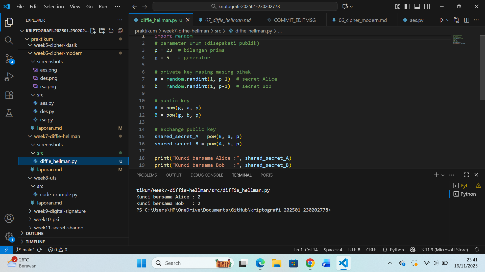

# Laporan Praktikum Kriptografi
Minggu ke-:07
Topik: Diffie-Hellman Key Exchange atau penukaran kunci publik.
Nama: Ratna Rizka Maharani
NIM: 230202778
Kelas: 5IKRB

---

## 1. Tujuan
Tujuan praktikum ini yaitu sbb:
1. Melakukan simulasi protokol Diffie–Hellman Key Exchange atau pertukaran kunci publik menggunakan Python.
2. Memahami proses pembentukan kunci bersama melalui operasi eksponensial modular.
3. Menganalisis potensi serangan, khususnya Man-in-the-Middle (MITM), pada protokol Diffie-Hellman.
4. Mengetahui mekanisme pertukaran kunci rahasia menggunakan bilangan prima dan logaritma diskrit.
5. Melakukan dokumentasi melalui laporan dan commit Git sesuai instruksi praktikum.

---

## 2. Dasar Teori
Diffie-Hellman adalah protokol pertukaran kunci yang memungkinkan dua pihak menghasilkan kunci rahasia bersama melalui saluran publik tanpa harus mengirimkan kunci tersebut secara langsung. dua pihak itu adalah mis. Alice dan Bob yang menghasilkan kunci bersama (shared secret) melalui saluran publik. Keamanan dasar Diffie-Hellman dalam menyelesaikan masalah logaritma diskrit jika 𝑝 adalah bilangan prima dan 𝑔 generator modulo 𝑝, maka dari publik 𝑔 𝑎 mod 𝑝 sulit untuk menemukan 𝑎 tanpa informasi tambahan, serta

Proses inti Diffie-Hellman terdiri dari: pemilihan bilangan prima besar p dan generator g, kemudian masing-masing pihak membuat private key 𝑎 dan 𝑏, mereka menghitung public key 𝐴 = 𝑔 𝑎  mod 𝑝 dan 𝐵 = 𝑔 𝑏  mod 𝑝 dan saling menukarnya, Kunci bersama dihitung sebagai 𝐾 = 𝐵 𝑎  mod 𝑝=𝐴 𝑏  mod 𝑝=𝑔 𝑎𝑏  mod 𝑝. Sehingga Kunci rahasia diperoleh melalui operasi modular yang menghasilkan nilai identik di kedua sisi.

Protokol ini mengandalkan konsep aritmetika modular dan logaritma diskrit, yaitu permasalahan matematika yang sulit dihitung balik sehingga memberikan keamanan.

Kelemahan Keamanan protokol ini bersandar pada kesulitan menghitung discrete logarithm problem. Namun, karena tidak ada autentikasi pada mekanisme dasarnya, Diffie-Hellman rentan terhadap serangan MITM, yaitu ketika penyerang menyisipkan dirinya di tengah komunikasi dan membuat dua kunci berbeda yang diketahuinya.

---

## 3. Alat dan Bahan
(- Python 3.12.10 
- Visual Studio Code / editor lain  
- Git dan akun GitHub  
- Library tambahan (misalnya pycryptodome, jika diperlukan)  )

---

## 4. Langkah Percobaan
(Tuliskan langkah yang dilakukan sesuai instruksi.  
Contoh format:
1. Membuat file `diffie_hellman.py` di folder `praktikum/week7-diffie-hellman/src/`.
2. Menyalin kode program dari panduan praktikum.
3. Menjalankan program dengan perintah `python diffie_hellman.py`.)

---

## 5. Source Code
Salin kode program utama yang dibuat atau dimodifikasi.  
Gunakan blok kode:
import random
```python
import random

# parameter umum (disepakati publik)
p = 23  # bilangan prima
g = 5   # generator

# private key masing-masing pihak
a = random.randint(1, p-1)  # secret Alice
b = random.randint(1, p-1)  # secret Bob

# public key
A = pow(g, a, p)
B = pow(g, b, p)

# exchange public key
shared_secret_A = pow(B, a, p)
shared_secret_B = pow(A, b, p)

print("Kunci bersama Alice :", shared_secret_A)
print("Kunci bersama Bob   :", shared_secret_B)
```


---

## 6. Hasil dan Pembahasan
- Lampirkan screenshot hasil eksekusi program (taruh di folder `screenshots/`).  
- Berikan tabel atau ringkasan hasil uji jika diperlukan.  
- Jelaskan apakah hasil sesuai ekspektasi.  
- Bahas error (jika ada) dan solusinya. 

Hasil eksekusi program Caesar Cipher:




---

## 7. Jawaban Pertanyaan
(Jawab pertanyaan diskusi yang diberikan pada modul. )
1. Mengapa Diffie-Hellman memungkinkan pertukaran kunci di saluran publik?
Jawab: Karena protokol ini tidak mengirimkan kunci rahasia secara langsung, Yang dikirim hanyalah public key hasil perhitungan eksponensial modular dua pihak dapat membuat kunci bersama meskipun komunikasi bersifat publik tetapi
keamanan bergantung pada masalah logaritma diskrit: walaupun nilai publik 𝑔 𝑎  mod 𝑝 dan 𝑔 𝑏  mod 𝑝 terlihat di jaringan, tanpa mengetahui 𝑎 atau 𝑏 sangat sulit (untuk p besar) menghitung 𝑔 𝑎𝑏 . Meskipun public key diketahui publik, kunci rahasia tetap aman sebab sulitnya menyelesaikan discrete logarithm problem.

2. Apa kelemahan utama protokol Diffie-Hellman murni?
Jawab: Kelemahan utamanya adalah tidak adanya autentikasi. Karena tidak mengecek identitas pihak yang bertukar public key dan protokol rentan terhadap serangan MITM yang dapat mengganti kunci publik pada saat pertukaran sehingga penyerang dapat memediasi dan mengetahui atau memanipulasi kunci serta ppenyerang dapat melakukan MITM dengan mudah dan membuat dua kunci rahasia yang diketahuinya.

3. Bagaimana cara mencegah serangan MITM pada protokol ini?
Jawab: - Menggunakan Digital Signature untuk memverifikasi public key.
- Menggunakan sertifikat digital (CA) seperti pada TLS.
- Menggunakan Diffie-Hellman terautentikasi (Authenticated DH).
- Menggabungkan Diffie-Hellman dengan mekanisme public key infrastructure (PKI).

---

## 8. Kesimpulan
Sehingga menurut sya dapat disimpulkan Percobaan Diffie-Hellman menunjukkan bahwasanya dua pihak dapat menghasilkan kunci rahasia yang sama meskipun berkomunikasi melalui saluran publik, karena keamanan bergantung pada sulitnya menyelesaikan logaritma diskrit. 

Pertukaran kunci menggunakan protokol Diffie-Hellman menyadari kelemahannya terhadap serangan MITM.
Namun, tanpa mekanisme autentikasi, protokol ini rentan terhadap serangan Man-in-the-Middle, di mana penyerang dapat menyisipkan diri dan membentuk kunci terpisah dengan masing-masing pihak dan mengetahui kunci rahasia kedua pihak. 

Oleh karena itu, implementasi Diffie-Hellman perlu dilengkapi autentikasi seperti tanda tangan digital atau sertifikat untuk mencegah penyusupan serta menjamin keamanan komunikasi, menjaga privasi Dlm komunikasi.

Hasil simulasi menunjukkan bahwa tanpa autentikasi, penyerang dapat dengan mudah mengganti public key dan memperoleh kunci rahasia. Sebab itu, autentikasi sangat penting dalam implementasi Diffie-Hellman di dunia nyata.

---

## 9. Daftar Pustaka
(Cantumkan referensi yang digunakan.  
Contoh:  
- Katz, J., & Lindell, Y. *Introduction to Modern Cryptography*.  
- Stallings, W. *Cryptography and Network Security*.  )
-  Paar, C., & Pelzl, J. (2010). Understanding Cryptography: A Textbook for Students and Practitioners. Springer.
- Trappe, W., & Washington, L. C. (2006). Introduction to Cryptography with Coding Theory (2nd ed.). Pearson.
- Singh, S. (1999). The Code Book: The Science of Secrecy from Ancient Egypt to Quantum Cryptography. Anchor Books
- Menezes, A. J., van Oorschot, P. C., & Vanstone, S. A. (1996). Handbook of Applied Cryptography. CRC Press.

---

## 10. Commit Log
```
commit 98af23cd1c91b2d77ac89ffbd77e3fa2c45c71a2
Author: Ratna Rizka Maharani <ratnarizka033@gmail.com>
Date:   14 November 2025

    `week7-diffie-hellman`.  Diffie-Hellman Key Exchange atau penukaran kunci publik.dan laporan 
```
