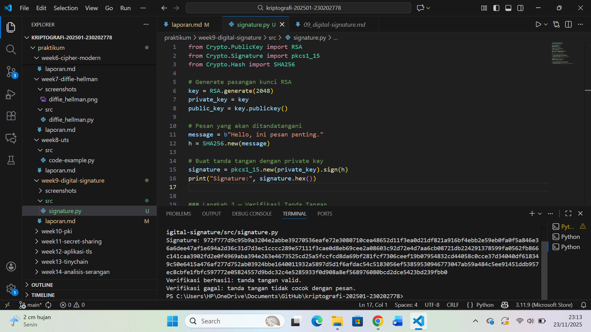
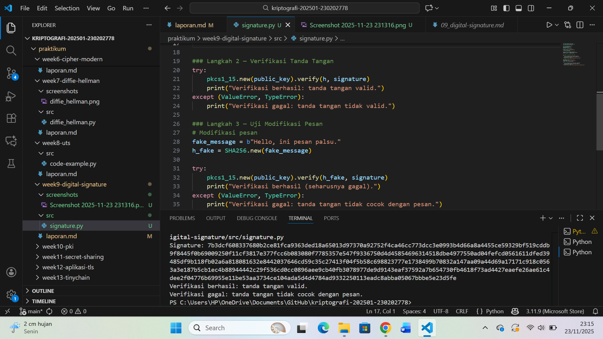

# Laporan Praktikum Kriptografi
Minggu ke-: 09
Topik: Digital Signature (RSA/DSA)  
Nama: Ratna Rizka Maharani 
NIM: 230202778
Kelas: 5IKRB

---

## 1. Tujuan
1. Mengimplementasikan pembuatan tanda tangan digital menggunakan algoritma RSA.=
2. Melakukan proses verifikasi tanda tangan digital menggunakan kunci publik.
3. Menguji integritas pesan dengan membandingkan pesan asli dan pesan yang telah dimodifikasi.
4. Menjelaskan manfaat tanda tangan digital dalam menjamin otentikasi dan integritas data.

---

## 2. Dasar Teori
Tanda tangan digital (digital signature)mrupakan mekanisme kriptografi yang digunakan untuk menjamin otentikasi, integritas, dan non-repudiation pada data digital. Berbeda dengan tanda tangan biasa yang berbasis tulisan tangan, tanda tangan digital menggunakan operasi matematika untuk menghasilkan nilai unik dari sebuah pesan. Sistem ini bekerja dengan memanfaatkan algoritma hashing seperti SHA-256 untuk menghasilkan jejak digital pesan, yang kemudian diproses menggunakan algoritma kriptografi kunci publik.

Pada algoritma RSA Digital Signature, proses penandatanganan dilakukan menggunakan private key, sedangkan verifikasi dilakukan menggunakan public key. Pesan tidak dienkripsi, melainkan dibuatkan hash yang kemudian dienkripsi dengan private key. Hasilnya adalah tanda tangan digital yang melekat pada pesan. Pada proses verifikasi, public key digunakan untuk mendekripsi tanda tangan dan membandingkannya dengan hash pesan yang dihitung ulang. Jika cocok, maka pesan dijamin asli dan tidak mengalami perubahan.

Algoritma DSA (Digital Signature Algorithm) adalah alternatif RSA untuk pembuatan tanda tangan digital dan dikembangkan oleh NIST. DSA menggunakan konsep logaritma diskrit dan berbeda dalam metode menghasilkan tanda tangan serta verifikasinya, tetapi tujuan utamanya sama: memastikan keaslian dan integritas pesan. Baik RSA maupun DSA digunakan secara luas pada protokol keamanan seperti SSL/TLS, sertifikat digital, dokumen elektronik, dan berbagai aplikasi modern yang membutuhkan validasi identitas pengirim dan integritas data.
---

## 3. Alat dan Bahan
(- Python 3.11  
- Visual Studio Code / editor lain  
- Git dan akun GitHub  
- Library tambahan (misalnya pycryptodome, jika diperlukan)  )

---

## 4. Langkah Percobaan
(Tuliskan langkah yang dilakukan sesuai instruksi.  
Contoh format:
1. Membuat file `signature.py` di folder `praktikum/week9-digital-signature/src/`.
2. Menyalin kode program dari panduan praktikum.
3. Menjalankan program dengan perintah ``src/signature.py`.)

---

## 5. Source Code
Salin kode program utama yang dibuat atau dimodifikasi.  
Gunakan blok kode:

```python
from Crypto.PublicKey import RSA
from Crypto.Signature import pkcs1_15
from Crypto.Hash import SHA256

# Generate pasangan kunci RSA
key = RSA.generate(2048)
private_key = key
public_key = key.publickey()

# Pesan yang akan ditandatangani
message = b"Hello, ini pesan penting."
h = SHA256.new(message)

# Buat tanda tangan dengan private key
signature = pkcs1_15.new(private_key).sign(h)
print("Signature:", signature.hex())
```

---

### Langkah 2 — Verifikasi Tanda Tangan
```python
try:
    pkcs1_15.new(public_key).verify(h, signature)
    print("Verifikasi berhasil: tanda tangan valid.")
except (ValueError, TypeError):
    print("Verifikasi gagal: tanda tangan tidak valid.")
```

---

### Langkah 3 — Uji Modifikasi Pesan
```python
# Modifikasi pesan
fake_message = b"Hello, ini pesan palsu."
h_fake = SHA256.new(fake_message)

try:
    pkcs1_15.new(public_key).verify(h_fake, signature)
    print("Verifikasi berhasil (seharusnya gagal).")
except (ValueError, TypeError):
    print("Verifikasi gagal: tanda tangan tidak cocok dengan pesan.")
```

---
```

```

## 6. Hasil dan Pembahasan
- Lampirkan screenshot hasil eksekusi program (taruh di folder `screenshots/`).  
- Berikan tabel atau ringkasan hasil uji jika diperlukan.  
- Jelaskan apakah hasil sesuai ekspektasi.  
- Bahas error (jika ada) dan solusinya. 

Hasil eksekusi program Caesar Cipher:





---

## 7. Jawaban Pertanyaan
(Jawab pertanyaan diskusi yang diberikan pada modul.  
1. Apa perbedaan utama antara enkripsi RSA dan tanda tangan digital RSA?
Jawab: Perbedaan utama antara enkripsi RSA dan tanda tangan digital RSA terletak pada tujuan penggunaan dan alur kerja kunci yang digunakan. Pada proses enkripsi RSA, pengirim menggunakan public key milik penerima untuk mengenkripsi pesan sehingga hanya penerima yang memiliki private key yang mampu mendekripsi dan membaca isi pesan tersebut. Hal ini bertujuan untuk menjaga kerahasiaan (confidentiality), yaitu memastikan bahwa pesan tidak bisa dibaca oleh pihak lain selain penerima yang sah.

Sebaliknya, pada tanda tangan digital RSA, proses yang terjadi justru kebalikannya: pengirim menggunakan private key untuk membuat tanda tangan digital atas pesan yang akan dikirim. Penerima kemudian menggunakan public key pengirim untuk memverifikasi keaslian tanda tangan tersebut. Tujuan dari mekanisme ini adalah memberikan *otentikasi, memastikan bahwa pesan benar-benar dibuat oleh pemilik private key, serta **integritas*, yaitu memastikan bahwa isi pesan tidak berubah sejak ditandatangani. Perbedaan alur penggunaan kunci inilah yang menjadi dasar mengapa fungsi enkripsi RSA dan tanda tangan digital RSA adalah dua hal yang berbeda meskipun keduanya menggunakan konsep kriptografi asimetris.

Selain itu, tanda tangan digital juga menjamin *non-repudiation*, yaitu pengirim tidak bisa menyangkal bahwa ia pernah mengirim pesan tersebut. Hal ini tidak dapat dicapai melalui enkripsi saja. Jadi, walaupun RSA digunakan dalam kedua proses, konteks, tujuan, dan penggunaan kuncinya sangat berbeda.


2. Mengapa tanda tangan digital menjamin integritas dan otentikasi pesan?
Tanda tangan digital mampu menjamin *integritas pesan* karena proses penandatanganan tidak dilakukan langsung pada isi pesan, tetapi pada hasil hash dari pesan tersebut. Fungsi hash yang digunakan, seperti SHA-256, menghasilkan nilai unik untuk setiap input dan sangat sensitif terhadap perubahan. Bahkan perubahan satu karakter saja pada pesan akan menghasilkan hash yang sangat berbeda. Ketika penerima memverifikasi tanda tangan digital, sistem akan menghitung ulang hash berdasarkan pesan yang diterima, lalu membandingkannya dengan hash hasil dekripsi tanda tangan dari pengirim. Jika kedua hash cocok, berarti pesan tidak dimodifikasi; jika tidak cocok, maka pesan dipastikan telah diubah. Dengan demikian, integritas pesan dapat dijamin sepenuhnya.

Selain integritas, tanda tangan digital juga memberikan otentikasi pengirim. Hal ini karena hanya pemilik **private key* yang sah yang dapat membuat tanda tangan digital yang valid. Ketika penerima memverifikasi tanda tangan dengan *public key*, hasil verifikasi berhasil hanya jika tanda tangan memang dibuat dengan private key yang berpasangan. Ini membuktikan bahwa pesan benar-benar berasal dari pemilik private key, sehingga identitas pengirim dapat dipastikan. Mekanisme ini tidak dapat dipalsukan tanpa mengetahui private key, yang secara teori sangat sulit untuk diretas. Oleh karena itu, tanda tangan digital dianggap sebagai salah satu metode otentikasi yang paling kuat dan aman dalam sistem keamanan modern.                                                                 
3. Bagaimana peran Certificate Authority (CA) dalam sistem tanda tangan digital modern?**
Jawab: Certificate Authority (CA) memiliki peran sangat penting sebagai pihak ketiga yang terpercaya dalam sistem tanda tangan digital modern. CA bertugas untuk mengeluarkan *sertifikat digital* yang berisi informasi penting seperti identitas pemilik, public key, masa berlaku, dan tanda tangan digital CA itu sendiri. Fungsi utama CA adalah memastikan bahwa sebuah public key benar-benar milik individu atau organisasi yang sah. Tanpa CA, seseorang bisa saja memalsukan identitas dengan membuat kunci sendiri lalu mengaku sebagai pihak tertentu, sehingga menimbulkan risiko serangan *man-in-the-middle* atau penipuan identitas.

Dalam praktiknya, CA melakukan proses verifikasi identitas melalui mekanisme yang disebut Public Key Infrastructure (PKI). Ketika seseorang ingin memiliki sertifikat digital, CA akan memeriksa kelengkapan identitas dan memastikan bahwa pemohon benar-benar pemilik kunci tersebut. Setelah valid, CA menandatangani sertifikat digital menggunakan private key CA, sehingga siapa pun bisa memverifikasi keabsahan sertifikat tersebut dengan public key CA yang sudah banyak dikenal dan dipercaya secara global.

Peran CA juga penting dalam menjaga kepercayaan dalam komunikasi digital, seperti pada HTTPS, SSL/TLS, email secure (S/MIME), dan dokumen resmi. Tanpa CA, sistem tanda tangan digital akan kehilangan fondasi kepercayaan karena tidak ada pihak yang menjamin bahwa public key yang beredar milik pihak yang benar. Dengan adanya CA, seluruh proses otentikasi dan verifikasi pada lingkungan digital menjadi aman, ter
---

## 8. Kesimpulan
(Tuliskan kesimpulan singkat (2–3 kalimat) berdasarkan percobaan.  )
menurut saya kesimpulannya yaitu Percobaan mengenai Digital Signature menggunakan algoritma RSA/DSA berhasil menunjukkan bagaimana proses penandatanganan dan verifikasi pesan dilakukan dalam sistem keamanan modern. Hasil pengujian membuktikan bahwa tanda tangan digital hanya valid untuk pesan asli, dan langsung gagal ketika pesan mengalami sedikit perubahan. Hal ini menegaskan bahwa mekanisme digital signature mampu menjamin integritas data, karena setiap modifikasi akan terdeteksi, serta memberikan otentikasi, karena hanya pemilik private key yang dapat membuat tanda tangan yang sah. Secara keseluruhan, percobaan ini menunjukkan bahwa digital signature merupakan komponen penting dalam menjaga keaslian, keamanan, dan kepercayaan dalam pertukaran informasi digital. 
---

## 9. Daftar Pustaka
Contoh:  
- Katz, J., & Lindell, Y. *Introduction to Modern Cryptography*.  
- Stallings, W. *Cryptography and Network Security*.  
- Katz, J., & Lindell, Y. Introduction to Modern Cryptography.
- Paar, C., & Pelzl, J. (2010). Understanding Cryptography: A Textbook for Students and Practitioners. Springer.
- Trappe, W., & Washington, L. C. (2006). Introduction to Cryptography with Coding Theory (2nd ed.). Pearson.
- Singh, S. (1999). The Code Book: The Science of Secrecy from Ancient Egypt to Quantum Cryptography. Anchor Books
- Menezes, A. J., van Oorschot, P. C., & Vanstone, S. A. (1996). Handbook of Applied Cryptography. CRC Press.
Dokumentasi PyCryptodome.

---

## 10. Commit Log
```
commit
Author: Ratna Rizka Maharani<ratnarizka033gmail.com>
Date:   23 november 2025

    week9-digital-signature: implementasi Digital Signature (RSA/DSA) dan laporan )
```
